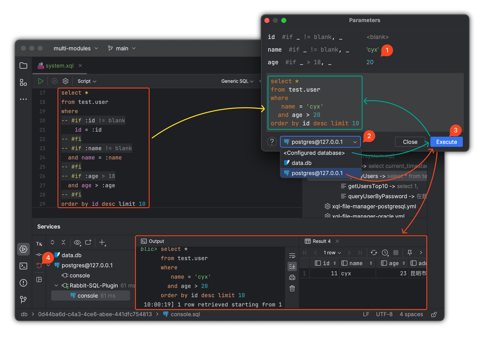

# 接口映射与插件

## 接口使用指南

### 动态代理接口

在 Spring Boot 启动类上添加注解 `@XQLMapperScan`，所有被 `@XQLMapper` 标记的接口都会被扫描到 Spring 上下文中，之后即可通过依赖注入使用接口。

```java
@SpringBootApplication
@XQLMapperScan
public class App {
    public static void main(String[] args) {
        SpringApplication.run(App.class, args);
    }
}
```

`ExampleService.java`

```java
@Autowired
private ExampleMapper exampleMapper;
```

### Baki 核心接口

除了接口映射之外，默认还提供了可选择的核心[接口Baki](documents/core-baki)。

- 通过 Baki 接口来执行增删改查、事务操作等基本数据库操作，避免直接与 JDBC 交互。
- 每个 SQL 操作都通过传递 SQL 名称来执行，并传入参数映射。

**SQL名示例**：

```java
@Autowired
private Baki baki;

public Stream<DataRow> getUsersByName() {
    return baki.query("&example.queryAllUsers").args().stream();
}
```

### 事务处理

- 推荐在复杂的业务操作中使用 Baki 提供的事务支持，确保数据一致性。
- 可以通过注解或手动方式进行事务管理。

**示例**：

```java
// 通过 Spring 注解管理事务
@Transactional
public void a() {
    
}
```

```java
// 通过手动管理事务
// com.github.chengyuxing.sql.spring.autoconfigure.Tx
@Autowired
Tx tx;

public void b(){
   tx.using(()->{

   });
}
```


## 插件使用指南

[插件][plugin]功能几乎都可以直接通过 IDEA 工具栏 **XQL File Manager** 面板来进行操作。

- 使用 [rabbit-sql-plugin][versions] 提供的 SQL 名自动完成、SQL 引用跳转和动态 SQL 测试功能，提升开发效率。
- 通过插件导航直接跳转到对应的 SQL 语句，方便开发和调试。
- 通过 **New** 创建 `xql-file-manager.yml`、XQL 文件、SQL 模板。

### 测试动态 SQL

有效利用[插件][plugin]进行[动态SQL](documents/xql-dynamic-sql)测试，确保在项目启动前最大化降低错误率，尤其是针对复杂动态SQL的计算，提前明白每个参数对动态SQL计算结果的影响。

- 选择第 **2** 步配置数据源的情况下可查看具体的执行效果，或者查看动态SQL的计算结果。

- 通过 **Execute '...'** 来测试动态SQL。

- 测试完毕点击第 **4** 步来回滚事务，以避免执行非查询语句造成数据被修改的问题。

  


[versions]:https://plugins.jetbrains.com/plugin/21403-rabbit-sql/versions
[plugin]:https://plugins.jetbrains.com/plugin/21403-rabbit-sql
