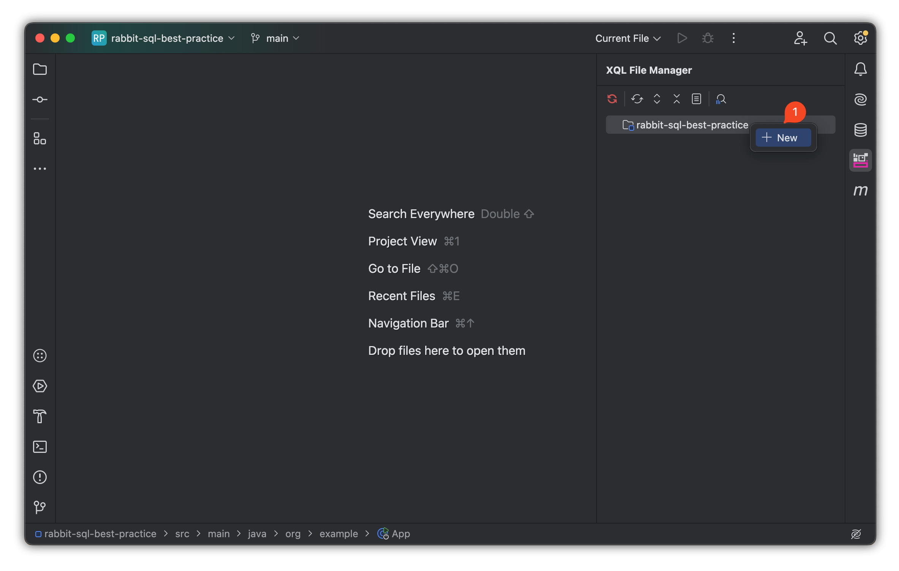
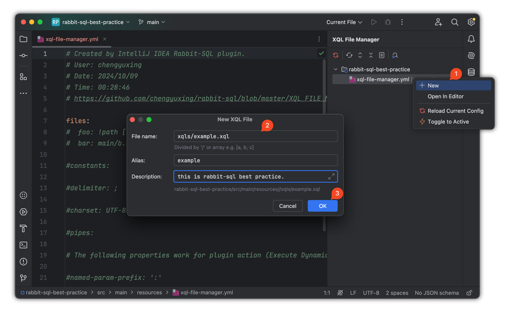

# 项目初始化

## 准备工作

**开发工具**：IDEA Ultimate 版本 2023.1 以上。

**Java 版本**：JDK 8 以上。

**安装插件**

- 通过 IDEA 插件商店安装：<kbd>Preferences(Settings)</kbd> > <kbd>Plugins</kbd> > <kbd>Marketplace</kbd> > <kbd>Search and find <b>"rabbit sql"</b></kbd> > <kbd>Install Plugin</kbd>；
- 通过插件[资源库][versions]手动下载安装：<kbd>Preferences(Settings)</kbd> > <kbd>Plugins</kbd> > <kbd>⚙️</kbd> > <kbd>Install plugin from disk...</kbd> > 选择插件安装包（不需要解压）。

## 创建项目与依赖

创建 Maven 项目。

### 使用 Spring Boot Starter

*JDK 8+*

```xml
<dependency>
    <groupId>com.github.chengyuxing</groupId>
    <artifactId>rabbit-sql-spring-boot-starter</artifactId>
    <version>{{starterVersion}}</version>
</dependency>
```

使用 Rabbit SQL 提供的 [Spring Boot Starter](documents/spring-boot)，通过单数据源自动配置可以简化配置、快速集成项目。通过 `application.yml` 或 `application.properties` 配置数据库连接。

**示例配置**：

```yaml
spring:
  datasource:
    url: jdbc:postgresql://127.0.0.1:5432/postgres
    username: chengyuxing
    password: 
```

### 创建 XQL 文件管理配置

1. 在 `.../src/main/resources` 目录下创建文件 [xql-file-manager.yml](documents/xql-file-manager) ，通过插件快速生成：

   

2. 创建 XQL 文件。通过插件创建 XQL 文件并自动注册到 [xql-file-manager.yml](documents/xql-file-manager)，降低手动配置的错误率：

   

**项目结构**：

- 建议将 `.xql` 文件统一放置在一个目录中，如 `/resources/xqls/`，并按照模块或功能分类，方便维护和管理。

- 将每个 `.xql` 文件的名称与模块功能对应，例如 **user.xql**、**order.xql**，以便于查找和维护。

**目录结构**：

```
/src
  ├─ main/
  |    ├─ java/org/example/
  |    └─ resources/xqls/
  |           ├─ user.xql
  |           └─ order.xql
```


[versions]:https://plugins.jetbrains.com/plugin/21403-rabbit-sql/versions
