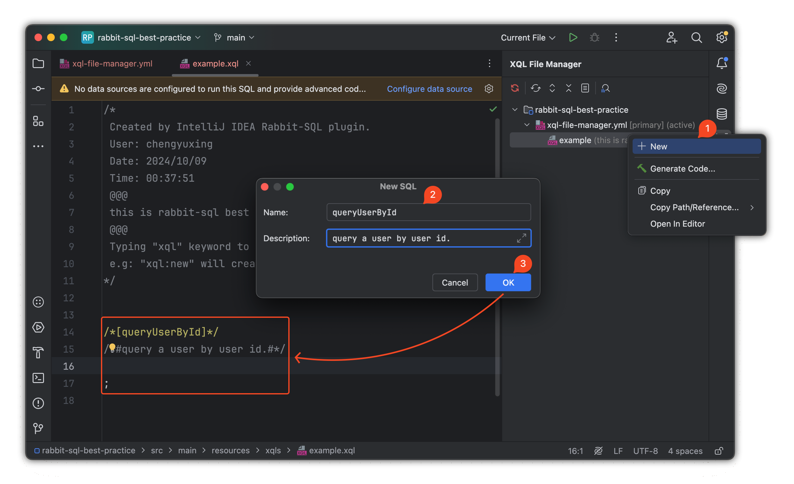
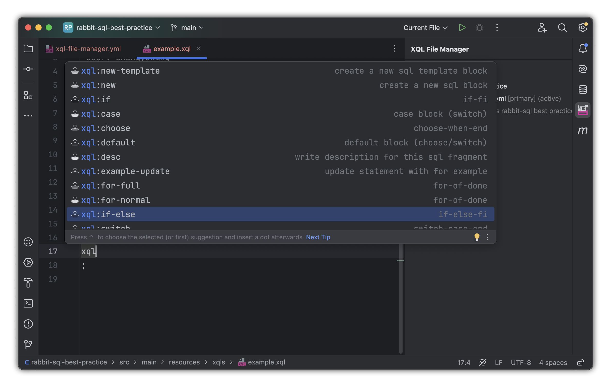
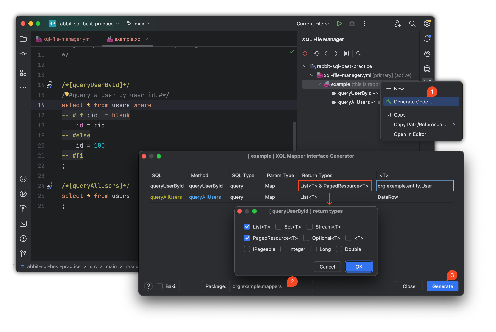
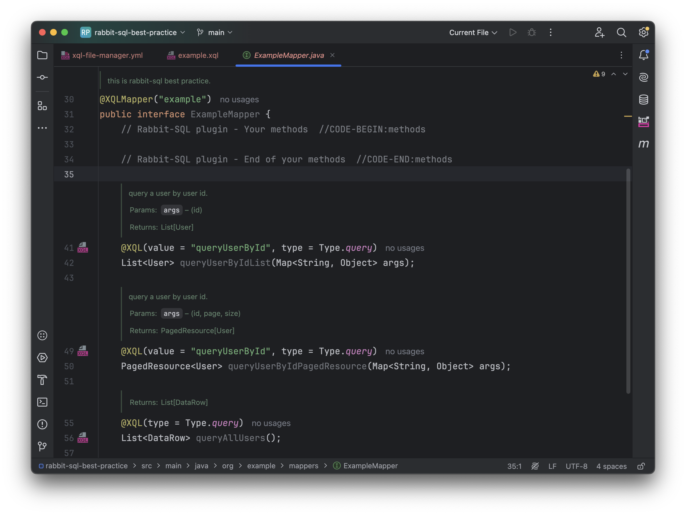

# XQL 编写最佳实践

## SQL 语句命名

- 在 `.xql` 文件中，使用清晰的 SQL 语句名称，有助于提高可读性和可维护性。

- 使用注释标记 SQL 语句名称，并为此条SQL添加具体描述。

- 通过插件创建一条 SQL 模板：

  

```sql
/*[findAllUsers]*/
/*#Some description.#*/
SELECT * FROM users;

/*[queryUserById]*/
/*#Some description.#*/
SELECT * FROM users WHERE id = :id;
```

> SQL 参数使用的是[命名参数](documents/core-sql-params) `:id`，会被预编译处理为 `?`，可有效避免 SQL 注入风险。

## 对象路径表达式

默认情况下通过形如： `:users.0` 获取 `users` 的第一个值，但在具有语法检查的 SQL IDE 中认为是语法错误，建议将写法改为标准的数组下标取值规避语法错误。

`{"users": [{"name": "cyx"}, {"name": "abc"}, ...]}`

```sql
SELECT * FROM users WHERE name = :users[0].name;
```

## 内联模板

XQL 文件管理器支持定义 SQL 内联模板片段 `-- //TEMPLATE-BEGIN:<name>`。如果一条 SQL 的条件必须和另一条 SQL 完全一致，例如分页查询条件，此时使用内联模板可以降低复杂度，也能避免单独模板片段在 SQL IDE 中因不完整 SQL 而出现语法检查错误或格式化异常：

```sql
/*[queryUserList]*/
select * from users where
-- //TEMPLATE-BEGIN:cnd
id = :id
-- //TEMPLATE-END
;

/*[queryUserCount]*/
select count(*) from users where ${cnd};
```

## PLSQL 语句块

XQL 文件管理器中，每个 SQL 对象根据结尾的 `;` 号来进行解析结构化，但有些DDL语句和 PLSQL 会包含多段 SQL，每个 SQL有 `;` 号结尾，为了保证解析的正确性，通过在 `;` 后面加上行注释 `--` 来进行规避，这是一种合理合法的规避方式：

```sql
/*[myProc]*/
begin;
  select 1; -- 也可以加点描述
  select 2; -- 
end;
```

## 动态 SQL

- [动态 SQL](documents/xql-dynamic-sql) 可以通过 `#if` 和 `#for` 等标签实现条件查询和循环查询，确保代码的灵活性。

- 在复杂查询中，推荐将公共的 SQL 片段拆分成可复用的 SQL 片段，避免重复代码。

- 通过插件提供的 **Live Template** 生成标签语句模板，输入 `xql` 关键字即可获取建议：

  

**示例**：

```sql
select * from users where
-- #if :id >= 100
  id = 99
-- #else
  id = :id
-- #fi
```

## For 循环指令

在构建类似  `in` 子句的情况下，通过上下文 `first` 属性来判断 `,` 拼接的时机规避 SQL 语法错误，虽然最终并不影响解析后的正确性，但在解析之前，在具有 SQL 语法检查的 IDE 中会提醒语法错误，影响格式化和美观，所以，强烈建议使用如下写法：

```sql
select * from users where id in (
-- #for item of :list; last as isLast
   -- #if !:isLast
   :item,
   -- #else
   :item
   -- #fi
-- #done
)
```

> 通过这样的写法在解析前就具有合法的  `in (:item, :item)` ，从而达到规避语法错误的展现形式。

## SQL 语句与接口方法映射

- 默认情况下，SQL 名与方法名一一对应；否则使用 `@XQL` 注解进行方法映射，确保 SQL 语句名称始终与方法有明确对应。
- 按照约定，[方法名的前缀](documents/xql-interface-mapping)代表 SQL 类型，例如 `queryUsers()` 会被框架判定为 `select` 查询操作，也可以使用 `@XQL` 改变默认查询行为。
- 当一个 SQL 语句需要映射到多个方法时，使用 `@XQL` 注解指定 SQL 名称。

当 SQL 编写好以后，使用[插件](guides/plugin#md-head-6)来快速生成**接口文件**和**方法注释文档**，减少重复操作，提高效率：



> Return Types: 选择需要返回的类型，有些 SQL 在一些情况是存在复用需要返回不同类型的需求。
>
> T: 默认情况下，返回类型泛型内置了 `DataRow` 和 `Map`，如果需要返回 java bean，则需要写**完全限定类名**，如上图 `org.example.entity.User`。
>
> 可重复点击 **Generate Code...**，每次都会记录上一次的配置。

### 额外分页配置

对于普通分页查询 SQL，框架默认会对列表查询 SQL 进行分页包装。特殊情况是实际分页部分位于子查询或视图查询中：

```sql
with cte as (select * from user limit :length offset :index)
select * from cte;
```

在最新版[插件](guides/plugin#md-head-6)和最新版 [Rabbit SQL](documents/changes) 中，可以填写 **Disable default page SQL** 属性，与真实 SQL 参数名一一对应；也可以为这条 SQL 指定专用的分页提供者（大多数情况下默认即可）。


此时，插件代码生成器可以实现 XQL 文件全属性配置100%覆盖，无需手动编辑。

### 映射接口

- `@XQLMapper(...)` 表明这是一个映射接口，并指定具体的 XQL 文件别名。



>  左侧导航图标表明sql和方法映射成功。
>
> 同一条 SQL 不同返回类型的复用，插件生成的接口格式为 **SQL名+返回类型**。
>
> 每次重新点击 **Generate Code...** ，接口文件 `//CODE-BEGIN ... //CODE-END` 区域之间的内容不会被覆盖，例如：
>
> ```java
> // Rabbit-SQL plugin - Your methods  //CODE-BEGIN:methods
> @Function("{:res = call func_get_user(:id)}")
> DataRow funcGetUser(@Arg("id")Param id);
> // Rabbit-SQL plugin - End of your methods  //CODE-END:methods
> ```

接口映射的更多使用方法和注意事项可具体参考文档[接口映射](documents/xql-interface-mapping)。
