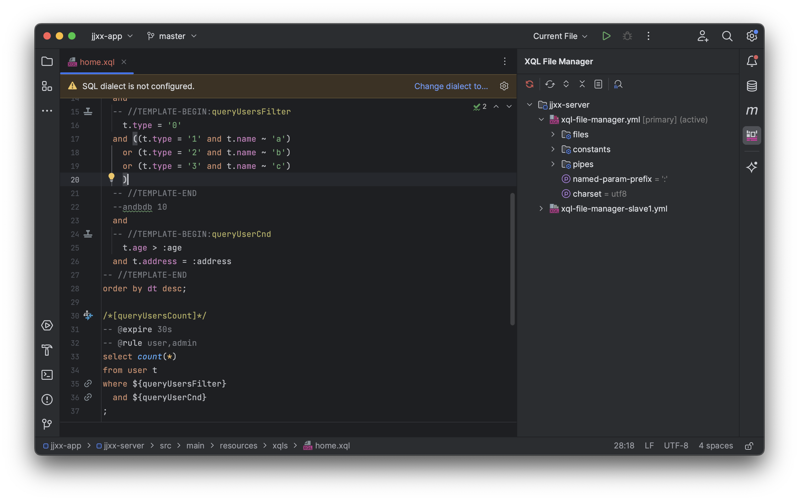

# 框架变更日志

## 10.3.20

本次同步更新：`rabbit-common 3.2.12`、`rabbit-sql 10.3.20`、`rabbit-sql-spring-boot-starter 5.3.21`、IDEA 插件 `2.4.63.231-263`。

### 实体映射与单表操作

- 修复 JavaBean 子类重写 getter 后无法找到父类字段的问题，支持多层继承；子类同名字段优先，保留对应字段的注解信息。`Args`、`DataRow` 的实体转换同步受益。
- 支持布尔属性的 `isXxx()` 方法引用，并按 JavaBean 规则处理属性名；未对应实体字段的方法引用会给出明确错误。
- 实体 CRUD 明确要求一个主键，拒绝复合主键、重复映射列名以及空表名、空列名，避免生成错误的更新或删除条件。
- 更换 `EntityMetaProvider` 时清除元数据缓存，并同步元数据创建、替换和关闭操作；更换后需要重新获取实体执行器。
- 所有插入入口统一校验 `NONE` 策略的非空主键，按主键更新的各入口也会拒绝空主键。
- 只有主键或没有可更新列的实体可查询、插入和删除；更新时明确报错。仅有 `IDENTITY` 主键时允许生成 `insert ... default values`，需确认目标数据库支持该语法。
- 修复插入 setter 在 `save()` 时重复应用初始赋值的问题，后续同一字段的最后一次 `.set(...)` 生效，重复使用时保留最新赋值。
- 条件构建器递归忽略空的 `and` / `or` 分组，避免产生多余连接符；空分组不视为更新、删除所需的有效条件。

### 批处理、JDBC 与参数解析

- 预编译批处理只遍历输入一次，不再丢失只能遍历一次的 `Iterable` 的首行；每行参数映射只执行一次。
- 逐行解析动态 SQL 和参数，修复 XQL 循环生成的参数沿用上一行值的问题；各行预编译 SQL 必须一致，结构变化会明确报错。已执行分批的整体回滚需要事务。
- 原始 SQL 批处理使用语句快照，避免监听器和异常处理再次消费输入；`table().enableBatch()` 的插入、更新支持空输入和只能遍历一次的输入。
- 默认参数处理器将 `File` / `Path` 读取为字节数组后绑定，避免内部打开的文件流泄漏；大文件可传入由调用方管理生命周期的 `InputStream`。
- 命名参数解析跳过 PostgreSQL 的 `$$...$$` / `$tag$...$tag$` 字符串及 MySQL 反引号标识符（包括双反引号转义），避免将其中的冒号误识别为参数。
- 校验页码、每页条数和批量大小为正数，拒绝负数记录总数及超出支持范围的分页偏移，修复分页计算的整数溢出。

### 事务、Mapper 与 XQL 管理

- 内置 `Tx` 明确拒绝同一线程上的嵌套事务，保留原事务状态，并且不执行内层回调。
- 修复连接初始化失败时的资源释放；事务提交失败会尝试回滚，业务异常优先保留，回滚与清理失败作为 suppressed exceptions 附加，清理失败仍会继续释放其他连接并清除线程状态。
- 修复 Mapper 代理的 `equals`、`hashCode`、`toString`；父接口未标记 `@XQLMapper` 时继承方法使用子接口别名，父接口已标记时保留父接口别名。`default` 方法仍不支持。
- XQL 初始化与重载基于上次成功配置快照决定资源复用；常量等配置改变时，即使文件名和修改时间未变也会重新解析。
- 同名管道可切换实现类；仅在加载的 `Class` 相同时复用实例，支持类加载器变化后的替换。
- 成功初始化时统一发布资源、管道和配置快照；失败时保留上次成功的资源和管道，可修正后重试。`close()` 与初始化互斥，并清理缓存和快照。
- 默认 Maven 测试选择无需外部数据库的回归用例，方便独立执行验证。

### Spring Boot Starter 5.3.21

- 升级依赖至 `rabbit-sql 10.3.20`，同步依赖示例和版本说明。本次没有新增 Starter 配置项。

### IDEA 插件 2.4.63

- 完整版本号为 `2.4.63.231-263`，兼容 IDEA `2023.1–2026.3`（build `231–263.*`），内置 `rabbit-sql 10.3.20` 和 `rabbit-common 3.2.12`，推荐搭配 Starter `5.3.21`。
- 从 Maven / Gradle 编译输出目录重新加载管道类，并更新类加载器；保存已注册的 `.xql` 和 `.sql` 文件均可刷新。
- 不同文件的动态 SQL 控制台与数据库执行会话独立，避免连接和事务状态相互影响。
- 重载时保留当前激活配置，并以快照支持并发读取。
- 改善 Mapper 输出路径及配置文件读写错误处理、通知调度和项目关闭时的资源清理。

相关使用规则见 [实体操作](documents/core-entity)、[事务](documents/core-transaction)、[批量操作](documents/best-practice-performance)、[XQL 文件管理器](documents/xql-file-manager) 和 [IDEA 插件](guides/plugin)。

## 10.3.19

- 修复接口映射方法参数为实体为继承关系，或者实体内没有字段的判定严格问题，内部逻辑改为转为空 `Map`

## 10.3.18

- ✅ 修复 `Baki#entity` 操作实体子类无法找到父类字段的 bug

## 10.3.17

- ✅ `MostDateTime` 优化重构，支持格式化包含时区 `XXX` ，例如：`MostDateTime#toString("yyyy-MM-dd'T'HH:mm:ss.SSSXXX")`
- ✅ 脚本解析引擎增加方法：`RabbitScriptEngine#eval` ：支持传入一个布尔条件表达式执行独立解析，例如：`:id != null`
- ✅ IDEA 插件 **Rabbit SQL** 更新版本 `2.4.62` ：
  - ✅ 主要针对修复了 IDEA 2026.3 的 XQL 管理器树节点双击跳转定义的 bug

## 10.3.16

- ✅ 修复动态 SQL 中 `blank` 的判断对于 `Iterable` 类型参数的 bug
- ❌ 移除方法 `StringUtils#isEmpty`
- ✅ `rabbit-sql-spring-boot-starter` 更新版本 `5.3.17`
- ✅ IDEA 插件 **Rabbit SQL** 更新版本 `2.4.61`

## 10.3.15

- ✅ 新增方法：`DataRow#accessAsIgnoreCase` 支持键名忽略大小写获取一个值
- ✅ 实体管理器增加内置默认简易实现：`EntityMetaProvider`
- ⚠️ 方法互相重命名：`StringUtils#isEmpty` 和 `StringUtils#isBlank`
- ✅ `rabbit-sql-spring-boot-starter` 更新版本 `5.3.16`
- ✅ IDEA 插件 **Rabbit SQL** 更新版本 `2.4.60`

## 10.3.14

- ✅ 修复实体映射转换实体时数据不存在将实体字段写入 `null` 覆盖默认值的问题
- ✅ `rabbit-sql-spring-boot-starter` 更新版本 `5.3.15`

## 10.3.13

- ❌ 动态 SQL 脚本解析器移除内置管道 `type`
- ✅ `FileResource` 优化，增加 `ConnectionInterceptor` 支持配置请求 HTTP 类型资源的参数选项
- ✅ SQL 高亮优化，支持内联模板、元数据定义高亮
- ✅ 对象路径表达式新增语法 `['key']` 支持获取 Map 中指定键名的数据，例如： `user.name['first-name']`
- ✅ 新增方法：`DataRow#walkAs` 支持目录表达式获取值 `user/addresses/0`
- ✅ 修复 XQL 接口映射查询方法返回 `Boolean` 类型的 bug
- ⚠️ `BakiDao#executionWatcher` 优化，方法重命名：`onStart` -> `before` , `onStop` -> `after`
- ✅ XQL 元数据 `-- @name value` 解析优化，逻辑调整为一直往后找，直到没有 `--` 行注释为止
- ❌ 移除方法：`Baki#insert` , `Baki#update` , `Baki#delete` ，使用 `Baki#execute` 替代
- ⚠️ 批量执行修改返回类型为 `BatchResult` ，支持获取每一行数据的执行情况
- ✅ XQL 接口映射支持批量执行标记 `XQL type = batch` 返回类型为 `BatchResult` 的方法
- ✅ `rabbit-sql-spring-boot-starter` 更新版本 `5.3.14`

### 插件工具

- ✅ **Rabbit SQL CLI** [Releases](https://github.com/chengyuxing/sqlc/releases) 更新版本 `3.0.3`
- IDEA 插件 **Rabbit SQL** 更新版本 `2.4.59` ，新增特性和优化如下：
  - 
  - ✅ **XQL File Manager** 控制面板完全支持解析和修改所有属性节点：`files` `pipes` `constants` `charset` `named-param-prefix`
  - ✅ **XQL File Manager** 控制面板**管道节点**支持显示和定位源码内置管道实现
  - ✅ 项目启动和重建索引触发 XQL 配置解析逻辑优化
  - ✅ **XQL 接口代码生成器**支持配置参数 `returnType` ，`paramType` ，`pageHelperProvider` 自动生成和管理 Java 类文件
  - ✅ **XQL 接口代码生成器**添加 SQL 类型、参数类型、返回类型之间关系的规则约束，降低配置错误率
  - ✅ **XQL 接口代码生成器**支持新的返回类型：`BatchResult` ，当 SQL 类型为 `batch` 时，参数类型定义变为泛型类型，接口将自动将参数包装为 `Iterable<T>`
  - ✅ XQL 文件编辑器中添加元数据的高亮 `-- @name value`
  - ✅ XQL 文件编辑器内支持高亮内联模板变量名，支持模板定义 `-- //TEMPLATE-BEGIN:xxx` 和使用位置 `${xxx}` 互相导航跳转
  - ✅ XQL 文件解析 SQL 名自动完成提示建议过滤模板定义变量名称
  - ✅ 代码生成器模板优化
  - ✅ 操作 `Selected opened file` 修复定位不准确的 bug
  - ✅ 修复操作 `Create XQL fragment` 没有正常弹出的 bug
  - ❌ 移除 Kotlin 源码文件目录的检测操作
  - ✅ 弹窗 UI 表单布局调整优化
  - ✅ 一些代码和逻辑优化

## rabbit-sql-spring-boot-starter

- ✅ XQL 接口映射动态代理注入逻辑优化
- ✅ 更新版本 `5.3.13`

## 10.3.12

- ✅ 分页查询逻辑优化
- ✅ XQL 文件结构化解析逻辑优化
- ✅ SQL 构建器优化
- 实体管理器 `EntityManager` ：
  - ✅ 构建 SQL 逻辑优化，提升性能
  - ✅ `EntityMeta` 增加主键生成策略，支持类型 `IDENTITY` ，对应 JPA 注解 `@GeneratedValue` 的策略，在执行 `insert` 时，不包含此列，默认为数据库的自增或序列
- ✅ `rabbit-sql-spring-boot-starter` 更新版本 `5.3.12`
- ✅ **Rabbit SQL CLI** [Releases](https://github.com/chengyuxing/sqlc/releases) 更新版本 `3.0.2`
- ✅ 对整体核心功能进行了一些优化
- 🥤 喝了一瓶可乐

## 10.3.10

- ✅ 工具类增加方法：`StringUtils#foreachWindow`（遍历匹配项周围一个区域的文本）
- ✅ `MostDateTime` 支持解析中文字符日期格式，例如：`二〇二六年六月二十六日` ，日期时间提取识别更宽松
- ✅ `rabbit-sql-spring-boot-starter` 更新版本 `5.3.10`
- ✅ **Rabbit SQL CLI** `3.0.1` 支持除存储过程/函数以外的 SQL 和 redis 查询结果导出文件（连接 redis 至少需要 jdk11）
- ✅ 对核心功能进行了一些优化

## 10.3.9

- ✅ 新增属性接口： `BakiDao#databaseInfoProvider` ，在动态数据源框架下，无需重写 `BakiDao#databaseInfo`
- ✅ `BakiDao#executionWatcher` 环绕执行器优化
- ❌ 删除接口 `ExecutionWatcher`
- ✅ `rabbit-sql-spring-boot-starter` 更新版本 `5.3.9`
  - ✅ 自动配置逻辑优化
  - ✅ 增加自动装配 `DatabaseInfoProvider` 接口 Bean
  - ⚠️ 自动装配 `ExecutionWatcher` 改为 `AroundExecutor<Execution>`

## 10.3.8

- ✅ 修改方法：`IPageable#disableDefaultPageSql` 接收2个参数 `start` 和 `end`
- ❌ 移除方法：`IPageable#rewriteDefaultPageArgs`
- ✅ XQL 映射接口新增支持返回类型：`String` `Boolean`
- ✅ `rabbit-sql-spring-boot-starter` 更新版本 `5.3.8`
- ✅ IDEA 插件更新版本 `2.4.52`
  - ✅ `@XQLMapperScan` 支持导航到 `@XQLMapper` 接口
  - ✅ 接口代码生成器返回类型分页查询支持配置 `@PageableConfig` 注解属性，用以实现自定义分页 SQL 配置自由度
    

## 10.3.7

- ✅ 修复只有一个关键字时 SQL 高亮产生的bug
- ✅ XQL 内联模板引用格式化优化
- ✅ `IOutput` 工具重构优化
- ✅ 新增方法 `BakiDao#databaseInfo` ，内部调用优化，支持重写：
  - 默认情况下初始化一次，单数据源和多实例多数据源默认即可
  - 动态路由数据源（不同类型数据库）通过重写此方法，来实时获取准确的数据库信息，以保证自动识别分页查询 SQL 的正确性
- ❌ 移除方法 `BakiDao#databaseId` ,`BakiDao#metadata`
- ⚠️ 动态 SQL 运行时常量 `_databaseId` 具体类型改为 `com.github.chengyuxing.sql.types.DatabaseInfo` ，通过 `_databaseId.name` 获取数据库名字
- ✅ 新增命令行版本工具：**Rabbit SQL CLI**，支持 Linux/macOS/Windows 等终端

## 10.3.3

- ✅ 修复了当 JDBC 驱动不支持设置 `queryTimeout` 属性时抛出异常错误的问题，若 `BakiDao#queryTimeoutHandler` 返回 0，则不进行设置

## 10.3.2

- ✅ 实体转换 `DataRow#toEntity` 提供的参数 `fieldMapper` 支持获取父类字段，增强继承实体的处理能力
- ✅ `rabbit-sql-spring-boot-starter` 更新版本 `5.3.2` 增加默认的 `EntityManager.EntityMetaProvider` 简单实现以满足简单实体处理需求

## 10.3.1

- ✅ 修复 `MostDateTime#of` 转化指定日期格式 `yyyyMMdd` 不包含时间部分的bug
- ✅ `rabbit-sql-spring-boot-starter` 更新版本 `5.3.1` 支持启动参数 `--xql.config.constants.[name]=[value]` 替换内置常量

## 10.3.0

- ✅ 一些小优化，并喝了一杯奶茶

## 10.2.9

- ✅ 修复 `MostDateTime` 转化时间格式 `yyyyMMdd` 的bug

## 10.2.8

- ✅ `XQLInvocationHandler` 接口映射逻辑优化
- ✅ `rabbit-sql-spring-boot-starter` 修复数据源异常时导致的 SQL 异常翻译出现空指针的问题

## 10.2.7

- ✅ 实体查询增加方法 `Query#forEach`

## 10.2.6

- ✅ 实体 `where` 条件构建器增加支持构建动态条件
- ✅ 接口 `Baki#table` 移除方法 `where` ，增加方法 `by` 通过传入数据库列名构建条件

## 10.2.5

- ✅ `XQLFileManager` 增加支持 SQL 对象定义元数据 `-- @name value` ，通过 `Sql#getMetadata` 获取，例如：
  ```sql
  /*[queryUsers]*/
  -- @cache 30m
  -- @rules admin,guest
  select * from users;
  ```
- ✅ `rabbit-sql-spring-boot-starter` 升级到 `5.2.5`
- ✅ IDEA 插件更新版本 `2.4.42` ，支持 Live template：
  - `xql:metadata`
  - `xql:new-inline-template`

## 10.2.4

### FOR 指令语法变更

⚠️ 动态 SQL `#for` 指令语法调整，最新的语法结构为：

```sql
#for item of :list [| pipe1 | pipeN | ... ] [;index as i] [;last as isLast] ...
...
#done
```

- ❌ 移除关键字：`delimiter` , `open` , `close`
- ✅ 增加关键字：`as`
- ✅ 增加上下文属性变量：`index` , `first` , `last` , `odd` , `even` 使用 `as` 关键字创建变量引用别名
- ✅ `rabbit-sql-spring-boot-starter` 最新支持版本 `5.2.4`

### XQL 管理器

- ✅ `XQLFileManager` 增加支持内联模板解析，其他 SQL 可根据名字直接引用，避免单独提取为模板片段对象：
  ```sql
  -- //TEMPLATE-BEGIN:<name> 
  ... 
  -- //TEMPLATE-END
  ```
  内联模板不可嵌套，且必须成对，如下例子：
  ```sql
  /*[queryList]*/
  select * from guest where
  -- //TEMPLATE-BEGIN:myInLineCnd
    -- #if :id
    id = :id
    -- #fi
  -- //TEMPLATE-END
  ;
  
  /*[queryCount]*/
  select count(*) from guest where ${myInLineCnd};
  ```
- ✅ 动态 SQL 布尔条件判断支持单目语法：`!:isAlien` ，等效于 `:isAlien == false`
- ✅ 动态 SQL 脚本引擎逻辑优化，增加支持动态 SQL 编译缓存
- ✅ 路径表达式解析优化
- ✅ IDEA [插件](https://plugins.jetbrains.com/plugin/21403-rabbit-sql/)最低版本支持：`2.4.41`

## 10.2.3

- 修复动态 SQL `#for` 指令循环体命名参数解析 BUG
- 动态 SQL 词法分析解析字符串安全优化

## 10.2.2

- ✅ `StringUtils#isNumber` 优化判断
- ✅ 对象路径表达式支持下标取值语法 `[]` ，例如：`user.addresses[0].name`
- ✅ `XQLFileManager` 解析文件优化
- ⚠️ 属性命名参数前缀 `namedParamPrefix` 从 `BakiDao` 中移到 `XQLFileManager` 作为全局配置项
- ✅ `StringUtils#isNonNegativeInteger` 非负整数判断优化
- ✅ `ValueUtils#getDeepValue` 性能优化
- ✅ 动态 SQL 解析词法分析优化
- ❌ `XQLFileManager` 移除属性 `databaseId`

## 10.2.1

- ✅ 新增标识符：`Baki#identifier`
- ✅ `Baki#entity.query` 第一个可选参数作为查询 ID 带入参数中，可通过 `Baki#identifier` 获取，为根据参数拦截 SQL 提供帮助
- ✅ XQL 接口映射参数解析优化
- ✅ SQL 异常拦截统一包装为：`com.github.chengyuxing.sql.exceptions.DataAccessException`
- ✅ Spring Boot Starter（5.2.1）实现 SQL 异常翻译对接到 Spring 的 `DataAccessException`，支持拦截 `DuplicateKeyException` 等异常
- ⚠️ 包名 `com.github.chengyuxing.sql.utils` 重命名为 `com.github.chengyuxing.sql.util`
- ⚠️ 包名 `com.github.chengyuxing.common.utils` 重命名为 `com.github.chengyuxing.common.util`
- ⚠️ 重命名以及性能优化：
  - `JdbcUtil` -> `JdbcUtils`
  - `Sqlutil` -> `SqlUtils`
  - `XQLMapperUtil` -> `XQLMapperUtils`
  - `StringUtil` -> `StringUtils`
  - `ObjectUtil` -> `ValueUtils`
  - `ReflectUtil` -> `ReflectUtils`
- ✅ 新增工具类：`NamingUtils`
- ⚠️ 实体映射解析逻辑调整以符合 Java Bean 规范，从找字段改为找属性，例如：`getName` -> `name`
- ✅ 新增方法：`DataRow#deepGetAs`
- ❌ 移除：`ImmutableList`
- ✅ `MostDateTime` 新增识别时间字符串格式：
  - `yyyyMMddHHmmssSSS`
  - `yyyy[-/]MM[-/]dd HH:mm:ss.[SSS|ffffff|nnnnnnnnn]`
- ✅ 动态 SQL 解析性能优化

## 10.1.2

- ✅ 实体操作 `insert` 优化了对主键为null的约束判断

## 10.1.1

- ✅ 实体查询增加方法：`query#select(...)` 可选择字段
- ❌ 移除了实体解析内置的默认实现：`EntityMetaProvider`

## 10.1.0

- ✅ 新增简单实体操作接口方法：`Baki#entity`
- ✅ 新增实体解析通用接口：`EntityMetaProvider`
- ❌ 移除接口：`EntityValueMapper` ，`EntityFieldMapper`
- ✅ Spring Boot Starter（5.1.1）增加自动配置 Bean：`EntityMetaProvider`

## 10.0.9

- ✅ Baki 批量修改操作接口参数新增支持实体集合映射到Map函数：
  ```java
  <T> int insert(@NotNull String sql, @NotNull Iterable<T> data, @NotNull Function<T, ? extends Map<String, ?>> argMapper);
  ```

## 10.0.8

- ⚠️ `Baki#insert` 一级接口第一个参数表名改为传入完整sql
- ✅ 新增方法 `Baki#table` 支持根据数据对单表生成简单 `insert, update, delete` 语句执行（批量）修改操作

## 10.0.7

- ⚠️ 查询缓存管理器重构优化，内部取消同步锁，更新和获取机制完全由接口实现控制：
  ```java
  @NotNull Stream<DataRow> get(@NotNull String sql, Map<String, ?> args, @NotNull RawQueryProvider provider);
  ```
- ✅ XQL 映射拦截注入接口重构优化，提高自由度
- ❌ Spring Boot Starter（5.0.8）自动配置移除了多数据源配置项
- ✅ Spring Boot Starter（5.0.8）默认单数据源自动注入配置优化，`BakiDao` 中所有接口对象类型属性都支持自动配置（`@Bean` 或 `@Component`），例如：
  ```java
  @Component
  public class RedisCacheManager implements QueryCacheManager {
      final RedisTemplate<Object, Object> redisTemplate;
      ...
  }
  ```
  缓存管理器将自动注入到 Baki 中

## 10.0.6

- ✅ 兼容 spring boot 4.0
- ⚠️ 移除了 `SqlParseChecker`，功能迁移到 `SqlInterceptor`
- ✅ `BakiDao` 内置分页查询优化，SQL 名解析为条数查询和记录查询语句优化

## 10.0.5

- ✅ 一些内部优化

## 10.0.4

- ✅ 管道参数增加支持变量，例如：`:a | plus(:b)`
- ✅ `#switch` 的 `#case` 支持变量
- ✅ 动态 SQL `#var` 定义变量支持出现在 `#for` 循环内作为局部变量
- ✅ 动态 SQL `#for` 解析逻辑优化
- ✅ 动态 SQL 强制用户参数和 `#var` 变量定义不能重复

## 10.0.3

- ❌ `XQLFileManager` 移除字段 `delimiter` ，内部重新优化解析逻辑，强制以单个 `;` 分割每个 SQL 对象，若 SQL 对象为过程语句包含多段 SQL，则在分号结尾使用行注释 `--` 来防止被提前截断，例如：
   ```sql
   /*[plsql]*/
   begin
    select 1;--
    select 2;--
   end;
   ```
- ❌ 字符串模板 `${}` 解析优化，移除 `TemplateFormatter`、`NamedParamFormatter`
- ✅ 动态 SQL 解析参数覆盖逻辑调整：用户参数覆盖内部 `#var` 定义的参数
- ✅ `PagedResource` 增加方法：`to`

## 10.0.2

- ✅ 动态 SQL 新增管道 `in`
- ✅ `ClasspathResource` 内部优化。

## 10.0.1

- ✅ 动态 SQL 流程控制语句增加支持守卫语句，如果条件满足则执行分支处理逻辑，否则执行 `#throw` 抛出异常信息并终止后面的所有操作。
  ```sql
  -- #guard :id > 0
  ...
  -- #throw 'message'
  ```
- ✅ 动态 SQL 支持前置条件检查语句，如果条件满足，则抛出异常：
  ```sql
  -- #check :id == null throw 'message'
  ```
- ✅ 动态 SQL 支持变量定义语句，并可以在 SQL 参数中使用变量：
  ```sql
  -- #var newId = :id
  -- #var list = 'a,b,c' | split(',')
  ```
- ✅ 管道支持不定长参数，例如：`split(',')` ，如果没有参数，不需要加括号。
- ✅ 内置管道增加：`split` , `nvl` , `type` 。
- ❌ 移除管道：`pairs` 。
- ✅ 动态 SQL 解析抛出异常增加具体的位置行号列号。
- ✅ 查询缓存管理器 `get` 方法增加第二个参数，SQL 执行期间的参数字典：
  ```java
  Stream<DataRow> get(String uniqueKey, Map<String, ?> args);
  ```
- ✅ 修复执行 oracle pl/sql 语句导致 `end` 结尾分号被去掉的问题。

## 10.0.0

- ⚠️ Rabbit SQL 从 `10.0.0` 开始，将只维护一个版本，默认最低支持 JDK 1.8；Starter 最低兼容 Spring Boot 2.7（JDK 1.8）
- ❌ 移除了对于内置 JPA 实体映射的支持，转而采用更灵活的映射接口扩展来支持自定义实现：
  - ✅ `EntityFieldMapper`
  - ✅ `EntityValueMapper`
- ❌ 移除了 `SaveExecuter` 、 `EntityExecuter` 、`GenericExecutor`。
- ✅ Baki 重新调整，增加一级接口 `insert`、`update`、`delete ` 、`execute` 、 `call` 。
- ✅ BakiDao 增加 `ExecutionWatcher` 属性，支持更灵活的 SQL 执行监听操作。
- ❌ BakiDao 移除 `SqlWatcher` 属性。
- ✅ PageHelper 增加方法 `countSql` ，支持重写专有的内置条数查询语句。
