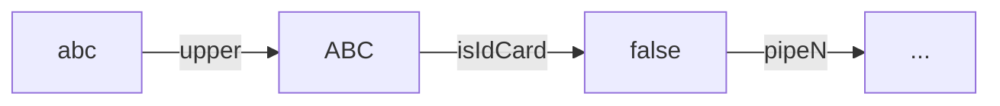

# 动态 SQL

作为整个框架的核心，动态 SQL 的管理和解析依赖于 [XQLFileManager](documents/xql-file-manager) ，基于标准 SQL 注释进行功能扩展，通过解析特殊的注释标记，在不破坏 SQL 文件标准的前提下进行动态解析。

动态 SQL 的内置控制指令包括：

- [变量定义](documents/xql-dynamic-sql#md-head-3)：`#var`
- [断言检查](documents/xql-dynamic-sql#md-head-2)：`#check`

- [If 逻辑判断](documents/xql-dynamic-sql#md-head-4)：`#if` , `#else` , `#fi`
- [守卫语句](documents/xql-dynamic-sql#md-head-5)：`#guard` , `#throw`
- [Switch 分支判断](documents/xql-dynamic-sql#md-head-6)：`#switch` , `#case` , `#default` , `#break` , `#end`
- [Choose 分支判断](documents/xql-dynamic-sql#md-head-7)：`#choose` , `#when` , `#default` , `#break` , `#end`
- [For 循环](documents/xql-dynamic-sql#md-head-8)：`#for` , `#done`

每个指令关键字以 `#` 号开头， 都必须单独成为一行，指令的组合有严格的规则，和程序语言中的几乎一致。

在动态 SQL 解析中，为了保证编辑器不影响 SQL 的格式化和避免语法检查误判，默认是加上行注释前缀 `--` ，但如果是 MySQL 的话，`#` 号就是标准注释，所以可以不用加 `--` 。

每个指令所在的表达式也有其特有的结构关键字，例如 For 循环中 `of` 就是专属的关键字：

```sql
#for item of :list

#done
```

控制指令中的变量以 `:` 号开头，和 SQL 的命名参数看上去都一样，但其含义并不同：

- SQL 语句：作为命名参数，会被动态编译为 `?` 号，作为 SQL 参数参与执行；
- 控制指令：值传递，为解析指令提供变量。

## 控制指令

每个控制指令都有其特定的语法结构，为了能更方便的理解，以下进行详细的介绍，包括其细节和一些使用技巧。

### 断言检查

前置条件检查语句，如果**满足条件** （`true`）则抛出 `throw` 异常信息（`CheckViolationException`），并终止后面的所有操作。

在数据库真正执行 SQL 之前，对参数做一次合法性验证，避免数据库层面的参数类型错误异常，以节省资源。

```sql
-- #check :id > 10 throw 'ID cannot gt 10.'
...
```

> 相比于在代码层面去验证参数合法性更加底层，特别是同一条 SQL 会被多个地方调用时，更加不容易遗漏参数校验。
>
> 代码层面则可以更专注于业务，做到职责分离。

### 变量定义

变量定义语句，变量值可以是[常量](documents/xql-dynamic-sql#md-head-10)，也可以是传入的参数经过[管道](documents/xql-dynamic-sql#md-head-15)处理，通过扩展管道，实现各种复杂的变量定义。

定义的变量可以通过 SQL 的命名参数形式传递给 SQL，同样也以为其他指令提供变量。

```sql
-- #var list = 'cyx,jack,mike' | split(',')
-- #var newId = :id
select * from table where id = :newId and name in (
-- #for item of :list; last as isLast
  -- #if :isLast
  :item
  -- #else
  :item,
  -- #fi
-- #done
)
```

### IF 逻辑判断

IF 条件判断语句，逻辑和编程语言中的 if 一样，是使用频率最高、也最简单的指令。完整语法如下，`#else` 可选。它没有 `else if`，如果需要多分支，使用 `#choose` 会更合适。

```sql
-- #if :user <> null
    ...
-- #else
    ...
-- #fi
```

### 守卫语句

如果条件满足则执行分支处理逻辑，否则执行 `#throw` 抛出异常信息并终止后面的所有操作。看上去和 `#check` 指令功能上有重叠，但他们却是有不同的职责，当同时满足条件时使用守卫语句：

1. 需要拼接动态 SQL；
2. 需要校验参数合法性；

```sql
-- #guard :user <> blank
    ...
-- #throw 'message'
```

> 对于需要拼动态 SQL 的部分，相当于 `#check` 和 `#if` 指令的组合使用，守卫语句则更加简洁。

### SWITCH 分支判断

效果和编程语言中的 switch 一样，按顺序匹配每个 case 分支并执行**等于**判断，第一个条件满足后直接跳出整个 switch。

`#case` 指令支持多组值：当多个值满足相同分支时，可以用逗号分隔来简化写法。`#default` 分支同样是可选的。

```sql
-- #switch :name
       -- #case 'a', 'b', c
       ...
       -- #break	
       -- #case 'd'
       ...
       -- #break
       ...
       -- #default
       ...
       -- #break
-- #end
```

> 在上面例子中，值 `c` 没有加引号，这不是错误，是动态 SQL 脚本中所支持的隐式转换，详细说明参考[字符串常量值](documents/xql-dynamic-sql#md-head-11)语法规则。

### CHOOSE 分支判断

结构和 `#switch` 相同，但每个 `#when` 分支接受一个比较表达式，按顺序匹配，第一个条件满足后直接跳出整个 choose。

choose 可以模拟 **如果-否则如果1-...-否则如果N-否则** 这样的结构。`#default` 分支同样是可选的。

```sql
-- #choose
       -- #when :id >= 0
       	...
       -- #break
       ...
       -- #default
       	...
       -- #break
-- #end
```

### FOR 循环

集合遍历语句，效果和编程语言一样，遍历一个集合并将循环体内容进行累加。

```sql
-- #for item of :list; index as i; last as isLast
	...
-- #done
```

**for表达式**语法说明：

关键字：`of` `as`

```
item of :list [| pipe1 | pipeN | ... ] [;index as i] [;last as isLast] ...
```

- `[...]` 表示可选配置项；
- `item` 表示当前值；
- `:list` 表示当前迭代的对象，后面可以追加[管道](documents/xql-dynamic-sql#md-head-15)进行一些特殊处理；
- 上下文属性：
  - `index` 当前项目的索引；
  - `first` 当前项目是否为第一个；
  - `last` 当前项目是否为最后一个；
  - `odd` 当前项目的索引是否为奇数；
  - `even` 当前项目的索引是否为偶数；

## 表达式脚本

表达式的最小比较单元语法为：`值A` `运算符` `值B` ，当比较值类型为 `blank` , `true` , `false` 时，可以简化写法为单目表达式，如下例子：
`!:isAlien` 等效于 `:isAlien == false` 。

变量以 `:` 号开头，其余形式则为常量值。

```sql
!(:id >= 0 || :name | length <= 3) && :age > 21 && !:isAlien
```

### 常量值

常量值的表示形式大致可以概括为**加引号**和**不加引号**，不加引号的情况下，会对常量值进行隐式转换，大部分情况下字符串是可以省略引号的。

#### 内置关键字

内置关键字有：`blank` , `null` , `true` , `false` 。

特别说明一下 `blank` 关键字，在字面的含义中表示空白，具体到值的类型可以用来表示：`null` ，空字符串，空数组，空集合，也是最常用的一个关键组，其余则表示其字面意思具体的类型。

#### 字符串

单引号或双引号包裹的字符组合，字符串：`""` ,`''` ，**关键字**和**数字**之外的其他字符组合。

例如：`a_b` , `"a_b"` , `'a_b'` 都是等价的，如果数字和关键字加上引号则真实类型就是字符串，例如：`blank` 不等于 `'blank'`。

因此，在大多数条件表达式的字符串比较中，可以省略引号以简化写法，例如：

```
:name = cyx
```

 这是一个合法的表达式，判断 `:name` 变量是否等于字符串 `cyx` 。

#### 数字

数字类型表示形式为：小数，正负数，整数。

例如：`3.14` , `-1` , `12` ，如果加引号则其具体类型就不再是数字，而是字符串。

### 比较运算符

| 运算符      | 说明       |
| ----------- | ---------- |
| `<`         | 小于       |
| `>`         | 大于       |
| `>=`        | 大于等于   |
| `<=`        | 小于等于   |
| `==` , `=`  | 等于       |
| `!=` , `<>` | 不等于     |
| `~`         | 正则包含   |
| `!~`        | 正则不包含 |
| `@`         | 正则匹配   |
| `!@`        | 正则不匹配 |

> 如果操作符不能满足需求，则可以通过实现自定义管道来进行增强。

### 管道



管道顾名思义，类似于 shell，可以链式使用 `:id | upper | is_id_card | ...` 例如传入的 `name` 参数值经过名为 `length` 的管道输出长度和 `3` 进行大小比较：

```sql
:name | length <= 3
```

通过实现接口 `com.github.chengyuxing.common.pipe.IPipe` 并添加到 [XQLFileManager](documents/xql-file-manager) 来使用管道。

**内置管道**：

- **length**：获取字符串的长度；
- **upper**：转大写；
- **lower**：转小写；
- **kv**：对象或 `Map` 转为一个键值对集合 `List<KeyValue>` ；
- **nvl**：如果值为 `null` 则返回默认值 ，例如：  `nvl('default')`；
- **split**：根据分隔符将字符串分割为数组，例如： `split(',')`；
- **in**：判断值是否包含在参数中，例如： `in('a','b','c')`

## 示例

以下的例子主要以动态生成**命名参数sql**来展开进行讲解，**命名参数**最终都会被进行预编译为 `?` ，避免 SQL 注入的风险。

**for** 标签特别是在构建 SQL 的 `in` 语句时且需要达到预编译 SQL 的效果时特别有用：

```sql
/*[query]*/
select * from test.user where id = 1
-- #if :ids
or id in (
    -- #for id of :ids; last as isLast
        -- #if :id >= 8
            -- #if !:isLast
                :id,
            -- #else
                :id
            -- #fi
        -- #fi
    -- #done
    )
-- #fi
;
```

```javascript
{"ids": [1, 2, 3, 4, 5, 6, 7, 8, 9, 10, 11, 12]}
```

在 SQL 中以 `:` 开头的变量名，表示这是一个会被预编译的命名参数；

> 如果 `in` 部分的数据来源可靠并且不强求预编译，也可以使用字符串模板实现，例如改成 `... or id in (${!ids})`。具体含义可参考[字符串模板](documents/core-sql-params#md-head-2)。

**for** 也可以用来构建 `update` 语句：

```sql
/*[update]*/
update test.user
set
-- #for set of :sets | kv; last as isLast
    -- #if !:isLast
    ${set.key} = :set.value,
    -- #else
    ${set.key} = :set.value
    -- #fi
-- #done
where id = :id;
```

```javascript
{
  "id": 10,
  "sets": {
    "name": "abc",
    "age": 30,
    "address": "kunming"
  }
}
```

说明：

- `:sets` 对应的值是一个 Map 对象，经过 `kv` **管道**后变成**键值对集合**，因此可以用于 **for** 表达式；

根据不同数据库进行判断来拼接适合的 SQL：

```sql
/*[query]*/
select * from test.user
where id = 3
-- #if :_databaseId.name == 'postgresql'
    ...
-- #fi
-- #if :_databaseId.name == 'oracle'
    ...
-- #fi
;
```

> 内置变量 `_databaseId` 的值是当前数据库信息对象 `com.github.chengyuxing.sql.types.DatabaseInfo`，由 BakiDao 在运行时提供。
