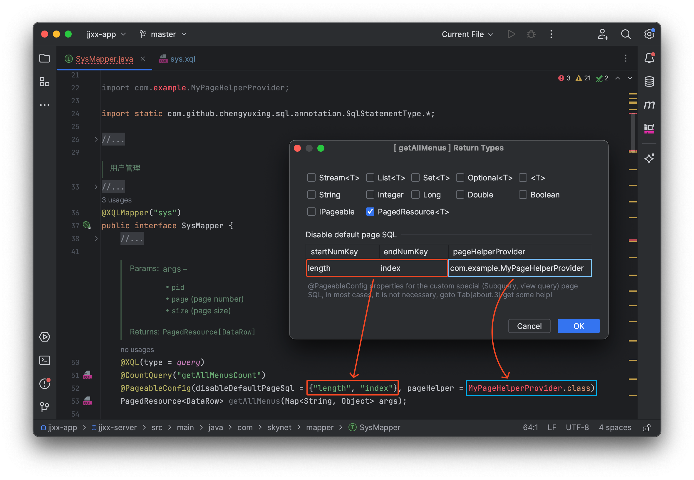

# XQL 文件接口映射

类似于 MyBatis 的 XQL 绑定接口，支持已注册到 **XQLFileManager** 的 **XQL**文件映射（ `BakiDao#proxyXQLMapper` ）到标记了注解 `@XQLMapper` 的接口，通过动态代理调用方法来执行相应的查询等操作。

```java
ExampleMapper mapper = baki.proxyXQLMapper(ExampleMapper.class)
```

`example.xql`

```sql
/*[queryGuests]*/
select * from test.guest where id = :id;

/*[addGuest]*/
insert into test.guest(name, address, age)values (:name, :address, :age);
```

`ExampleMapper.java`

```java
@XQLMapper("example")
public interface ExampleMapper {
  List<DataRow> queryGuests(Map<String, Object> args);
  
  @XQL(value = "queryGuests")
  Optional<Guest> findById(@Arg("id") int id);
  
  @XQL(type = SqlStatementType.insert)
  int addGuest(DataRow dataRow);
}
```

> @XQLMapper 注解中的值对应 XQLFileManager 中已注册的 XQL 文件别名。
>
> 如果装有 Rabbit SQL 插件，可以使用插件快速生成接口，参考指南 [IDEA 插件](guides/plugin#md-head-6)。

## 接口规范

如果接口方法标记了以下特殊注解，将忽略接口的映射关系，并执行此注解的具体操作：

- 存储过程： `@Procedure`
- 函数： `@Function`

接口方法不能定义默认实现 `default` 方法，调用时会明确报错。

继承方法的父接口未标记 `@XQLMapper` 时，使用代理子接口上的别名；父接口自身已标记时，保留父接口的别名。代理的 `equals` 使用对象身份比较，`hashCode` 使用身份哈希，`toString` 输出代理说明，均不会触发 SQL 执行。

## 映射规则

默认情况下，所有方法都根据方法名前缀来确定执行类型，并且 **SQL 名字**和**接口方法名**一一对应。如果二者不对应，可以使用注解 `@XQL(value = "sql名", type = SqlStatementType.insert)` 指定具体 SQL 名，并覆盖默认的 SQL 类型推断。接口方法定义需遵循以下规范：

| SQL 类型             | 方法前缀                                                  |
| -------------------- | --------------------------------------------------------- |
| select               | select \| query \| find \| get \| fetch \| search \| list |
| insert               | insert \| save \| add \| append \| create                 |
| update               | update \| modify \| change                                |
| delete               | delete \| remove                                          |
| batch                | batch                                                     |
| procedure / function | call \| proc \| func                                      |

## 参数类型

- 参数字典：`DataRow` 、 `Map<String,Object>` 、 `<JavaBean>`
- 参数列表：使用注解 `@Arg` 标记每个参数的名字

## 返回值类型

接口方法返回值类型定义如下表：

| 返回类型                                               | SQL 类型                                                     | 备注                             |
| ------------------------------------------------------ | ------------------------------------------------------------ | -------------------------------- |
| `List<DataRow/Map<String,Object>/<JavaBean>>`          | query                                                        |                                  |
| `Set<DataRow/Map<String,Object>/<JavaBean>>`           | query                                                        |                                  |
| `Stream<DataRow/Map<String,Object>/<JavaBean>>`        | query                                                        |                                  |
| `Optional<DataRow/Map<String,Object>/<JavaBean>>`      | query                                                        |                                  |
| `Map<String,Object>`                                   | query                                                        |                                  |
| `PagedResource<DataRow/Map<String,Object>/<JavaBean>>` | query                                                        | `@CountQuery`，`@PageableConfig` |
| `IPageable`                                            | query                                                        | `@CountQuery`，`@PageableConfig` |
| `Long`、`Integer`、`Double`、`String`、`Boolean`       | query                                                        |                                  |
| `<JavaBean>`                                           | query                                                        |                                  |
| `DataRow`                                              | query, procedure, function, plsql, ddl, unset, insert, update, delete |                                  |
| `int/Integer`                                          | insert, update, delete                                       |                                  |
| `BatchResult`                                          | batch                                                        |                                  |

## 分页查询配置

如果方法返回类型为 `PagedResource` 或 `IPageable`，还可以配置更多分页参数。

**条数查询配置**：默认情况下，条数查询语句使用简单的 `count(*)` 构建，例如：

```sql
select count(*) from ( /*你的查询语句*/ );
```

可以通过 `@CountQuery()` 自定义条数查询语句。

**分页参数配置** `@PageableConfig` 属性：

- `disableDefaultPageSql`：禁用框架内置的自动分页 SQL 生成，并**按顺序**指定分页参数键名 `[start, end]`。框架会按这两个键名绑定计算好的分页参数，例如：

  ```sql
  # PostgreSQL
  select * from test.user limit :length offset :index;
  
  # Oracle
  select *
    from (select t.*, rownum ROW_NUM_KEY
          from (...) t
          where rownum <= :end)
     where ROW_NUM_KEY >= :start;
  ```

- `pageHelper` : 不使用内建的全局分页，仅针对此条 SQL 使用自定义的分页提供实现。



可以通过[插件](guides/plugin)配置分页参数，参数对应关系如上图。

Spring Boot 自动扫描机制：通过在启动类上加上注解 `@XQLMapperScan` 来实现自动生成代理，即可注入使用，具体可参考文档 [集成 Spring Boot](documents/spring-boot#md-head-7) 和 [接口映射与插件](documents/best-practice-mapper)。
