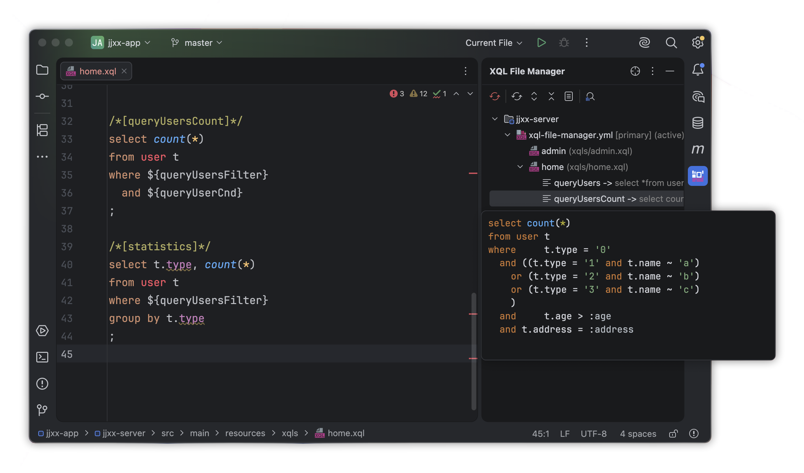

# SQL 模板复用技巧

Rabbit SQL 支持两种形式的模板声明方式。多数情况下，模板用于提取相同查询条件，达到多段 SQL 复用的效果。但这些片段往往不是完整 SQL，在 IDE 中可能产生高亮或格式化异常。

因此，推荐使用[内联模板](documents/xql-file-manager#md-head-15)声明方式，语法格式为：

```sql
-- //TEMPLATE-BEGIN:myCnd
...
-- //TEMPLATE-END
```

> `myCnd` 是这段模板的名称，可在同一文件内直接引用。

如果安装有 [IDEA 插件](guides/plugin)，通过输入 `xql:new-inline-template` 自动完成。

例如，一个 SQL 对象中可以定义多个模板片段（不支持嵌套）：

```sql
/*[queryUsers]*/
select * from user t
where 
  t.enable = true
  and
  -- //TEMPLATE-BEGIN:queryUsersFilter
   t.type = '0'
  and((t.type = '1' and t.name ~ 'a')
  or (t.type = '2' and t.name ~ 'b')
  or (t.type = '3' and t.name ~ 'c')
  )
  -- //TEMPLATE-END
  and
  -- //TEMPLATE-BEGIN:queryUserCnd
   t.age > :age
  and t.address = :address
  -- //TEMPLATE-END
  order by dt desc;
```

上面的例子有几点值得注意：

- 模板内部的第一个连接条件 `and` 放在模板外，这样在引用模板的地方由调用方决定是否需要 `and`，也能避免 IDE 误报语法错误；
- 两个模板片段都以当前 SQL 名开头命名，在模板数量较多时能避免混乱。

通过 [IDEA 插件](guides/plugin)，可以直接查看模板的合并效果，如下图：



> 多个模板引用时，使用条件连接符可以避免语法高亮错误。

模板片段内仍然可以使用[动态 SQL](documents/xql-dynamic-sql)脚本。两者是相互独立的逻辑，合理使用可以让整个 SQL 更清晰直观。
