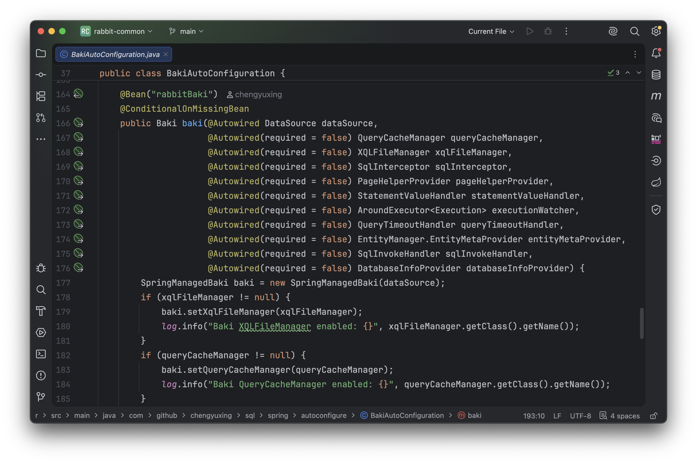

# 动态路由数据源

以 Spring Boot 框架为例，将动态路由数据源整合进 BakiDao 中，无侵入式的使用动态路由数据源，需要准备以下几点：

1. 使用 Spring Boot 框架
2. 引入 `rabbit-sql-spring-boot-starter` 版本 5.3.10+
3. 引入一个[动态路由数据源](https://github.com/baomidou/dynamic-datasource)例如：`dynamic-datasource-spring-boot-starter`
4. 重写 `BakiDao` 相关方法
5. 添加到 Spring 上下文容器中

> 基于 Spring Boot ，动态路由数据源路由能力实际上内置支持 `AbstractRoutingDataSource`，具体的实现扩展有很多，或者自己实现一个满足特定业务的动态数据源也行。

## 核心接口配置

### 5.3.9以下

继承 `SpringManagedBaki` 重写方法 `databaseInfo()`：

```java
public DynamicDatasourceBaki extends SpringManagedBaki{
    private final Map<String, DatabaseInfo> DB_INFO = new ConcurrentHashMap<>();
  
    public DynamicDatasourceBaki(DataSource dataSource){
        super(dataSource);
  }
  
    @Override
    public @NotNull DatabaseInfo databaseInfo() {
        if(getDataSource() instanceof DynamicDataSource){
             String key = DynamicDataSourceContextHolder.peek();
             return DB_INFO.computeIfAbsent(key, k -> {
                 return using(DatabaseInfo::of);
          });
        }
        return super.databaseInfo();
    }
}
```

默认情况下，一个 BakiDao 绑定一个数据源，初始化一次 `databaseInfo()` ，用于提供当前数据库信息给分页查询自动生成合适的分页 SQL 等一些扩展功能。

在动态数据源的情况下，为了适配不同类型的数据库，所以此方法必须重写，记录下不同数据源的信息，为了 `BakiDao` 内依赖的插件得以正确运行。

实际上重写此方法的大致思路就是：

1. 判断当前是不是动态路由数据源
2. 通过动态路由数据源上下文当前对象获取当前线程中的数据库名字
3. 缓存名字所代表数据源与其匹配的 `DatabaseInfo` ，避免重复请求

> 不同的动态路由数据源实现有所不同，以上代码例子仅做参考，根据这个思路来实现即可。

添加到 Spring 容器中：

```java
@Bean
public Baki baki(DataSource dataSource,
                XQLFileManager xqlFileManager){
   DynamicDatasourceBaki baki = new DynamicDatasourceBaki(dataSource);
   baki.setXQLFileManager(xqlFileManager);
   return baki;
}
```

根据需要注入其他扩展实现如图：



### 5.3.9+

无需重写 `BakiDao#databaseInfo` ，实现接口 `com.github.chengyuxing.sql.plugins.DatabaseInfoProvider` 配置为 Bean 即可生效。

```java
@Component
public class DynamicDatabaseInfoProvider implements DatabaseInfoProvider {
    private final Map<String, DatabaseInfo> INFO = new ConcurrentHashMap<>();

    @Override
    public @Nullable DatabaseInfo resolve(@NotNull DataSource dataSource, Supplier<DatabaseInfo> supplier) {
        if (dataSource instanceof DynamicDataSource) {
            String key = DynamicDataSourceContextHolder.peek();
            return INFO.computeIfAbsent(key, k -> supplier.get());
        }
        return null;
    }
}
```

> 以上实现同样建议使用缓存，每次调用 `Supplier<DatabaseInfo> supplier` 都会获取一个连接，使用缓存避免不必要的开销。

## 应用

除核心接口 `Baki` 外， Rabbit SQL 支持[接口映射](documents/xql-interface-mapping)，在动态数据源的场景中，会更加直观规范化。

在接口上添加注解 `@DS("slave_db")` 即可切换数据源。

推荐使用[插件](guides/plugin#md-head-12) <kbd>Generate Mapper...</kbd> 来生成接口类，其中有3个区域可手动增加内容不会在重复生成的过程中丢失，注解添加在如下区域内 `//CODE-BEGIN/END:annotations`：

```java
// Rabbit SQL plugin - Your annotations  //CODE-BEGIN:annotations
@DS("slave_db")
// Rabbit SQL plugin - End of your annotations  //CODE-END:annotations
@XQLMapper("home")
public interface HomeMapper{
  
}
```

在 service 中注入 `HomeMapper`  即可连接 `slave_db` 这个数据源进行一系列操作。
