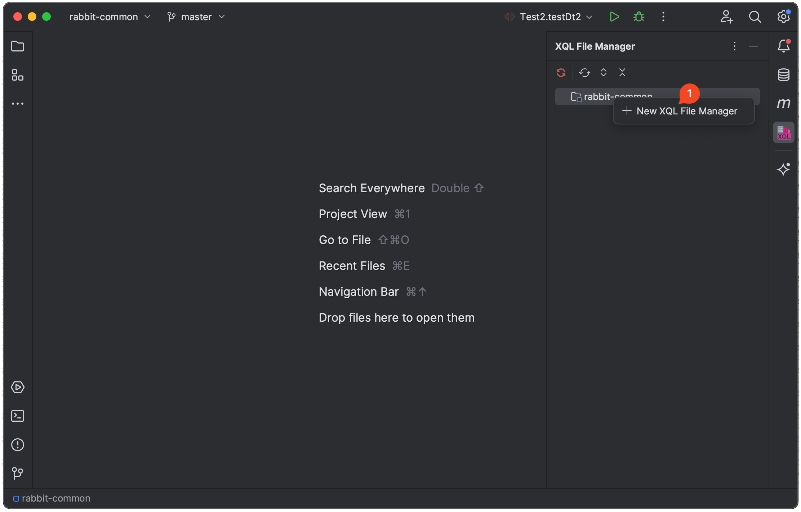
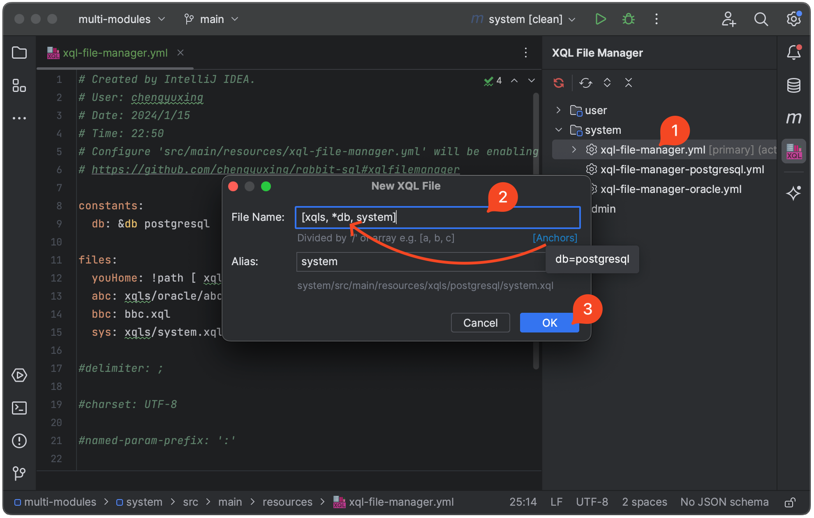
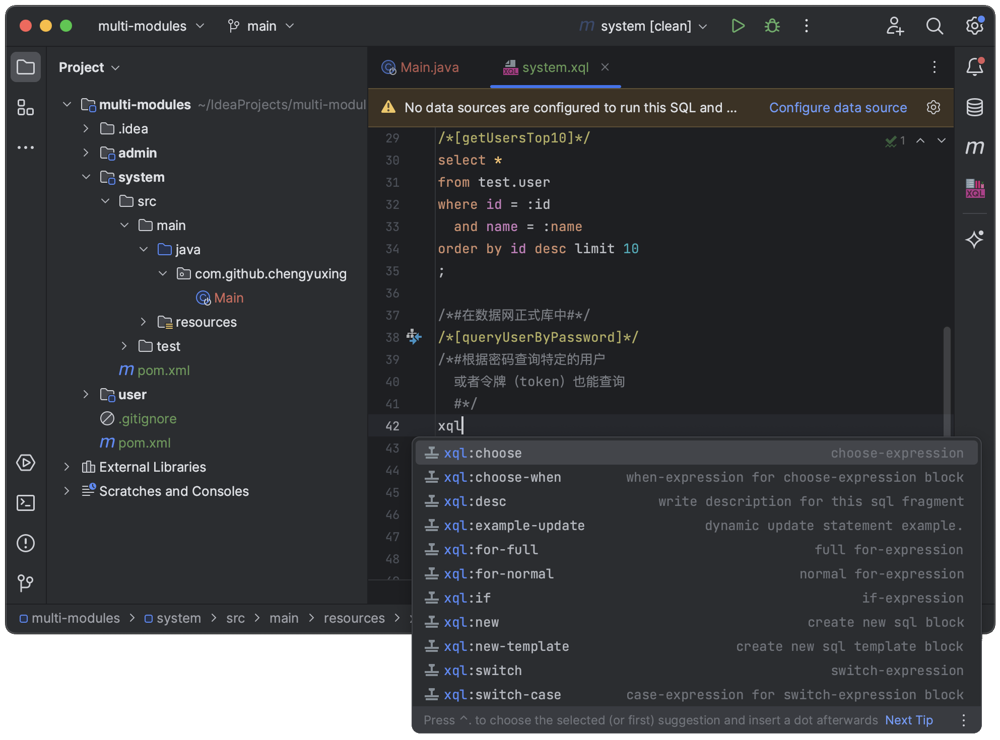
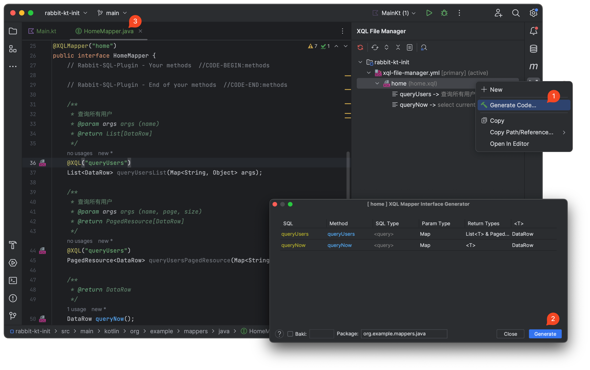
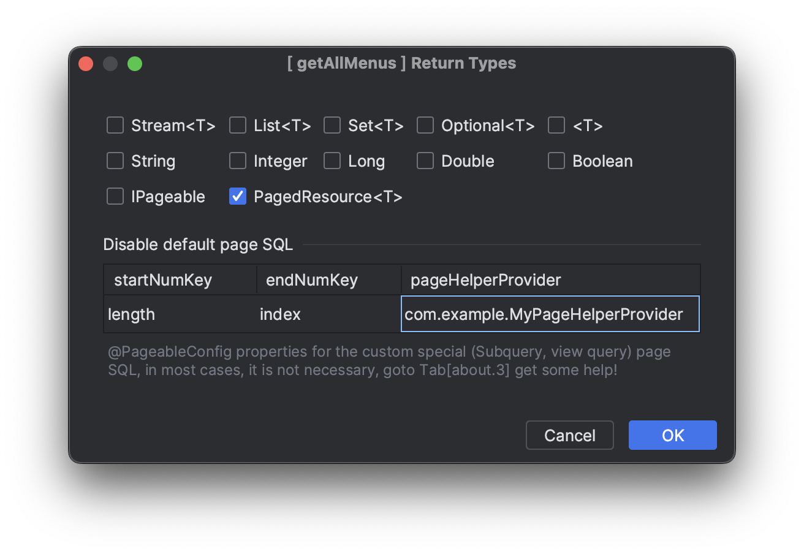
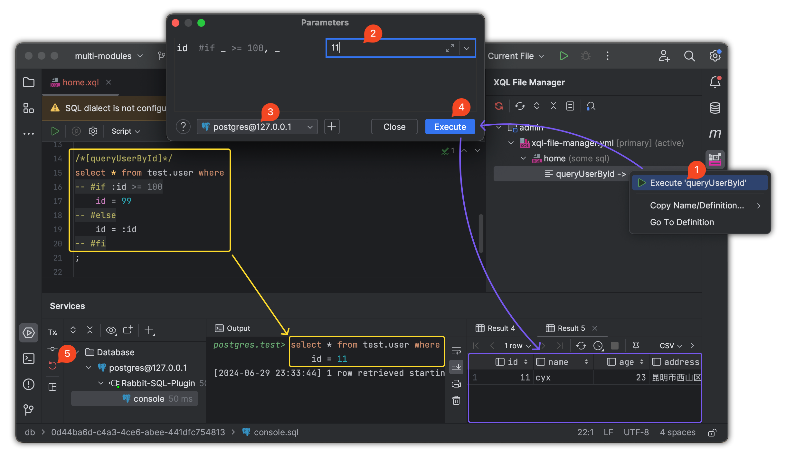

# 使用 Rabbit SQL 插件

专为 Rabbit SQL 框架开发的 IDEA 插件，通过安装插件可以极大的简化开发流程，降低手动配置的错误率。

<iframe width="100%" height="270px" src="https://plugins.jetbrains.com/embeddable/card/21403"></iframe>

当前版本为 `2.4.64.231-263`，兼容 IDEA `2023.1–2026.3`（build `231–263.*`）。插件内置 `rabbit-sql 10.3.21` 与 `rabbit-common 3.2.13`，推荐项目依赖使用 Rabbit SQL `{{rabbitSqlVersion}}`、Starter `{{starterVersion}}`，使动态 SQL 解析行为保持一致。

## 安装插件

- 通过 IDEA 插件商店安装：<kbd>Preferences(Settings)</kbd> > <kbd>Plugins</kbd> > <kbd>Marketplace</kbd> > <kbd>Search and find <b>"rabbit sql"</b></kbd> > <kbd>Install Plugin</kbd>；
- 通过插件[资源库](https://plugins.jetbrains.com/plugin/21403-rabbit-sql/versions)手动下载安装：<kbd>Preferences(Settings)</kbd> > <kbd>Plugins</kbd> > <kbd>⚙️</kbd> > <kbd>Install plugin from disk...</kbd> > 选择插件安装包（不需要解压）。

## XQL File Manager 工具窗口

此时 IDEA 的 Toolwindow 工具栏上就出现了图标：</img> **XQL File Manager** ，大部分的操作都将围绕着这个工具窗口。

### 新建配置文件

工具窗口内会识别出所有标准的 Maven 项目，如果是其他项目，需要手动创建目录：

```
src/main/resources
```

此时插件就能识别到项目，后续可以进行一系列操作，右键项目 <kbd>New</kbd> 弹出表单 ：



- 如果 `resources` 目录下没有 `xql-file-manager.yml` ，则自动创建；
- 如果有，则填入一个新的名称创建  `xql-file-manager-*.yml` ；

> [Rabbit SQL Spring Boot Starter](documents/spring-boot) 默认加载名为 `xql-file-manager.yml` 的配置文件，其他则通过属性：`xql-file-manager.config-location` 来指定。

### 新建 XQL 文件

xql-file-manager.yml 右键 <kbd>New</kbd> 弹出表单新建一个 XQL 文件：



文件名是文件全路径名，支持数组格式或者路径格式，并填入别名，点击 <kbd>Ok</kbd> 创建文件，并自动注册到 `xql-file-manager.yml` 中，避免手动操作导致错误。

#### 新建 SQL 片段

可以选择手动编辑 XQL 文件，或者通过插件创建。在 XQL 文件上右键 <kbd>New</kbd>，弹出表单填入相关信息来创建一个 SQL 片段，插件会自动在 XQL 文件结尾插入一个 SQL 片段模板：

```sql
/*[queryUsers]*/
/*#查询所有用户#*/

;
```

XQL 文件支持 **Live Template**，通过输入关键字 `xql` 弹出建议，快速生成模板，例如：

- `xql:new` 自动生成一个 SQL 片段模板；
- `xql:if` 自动生成动态 SQL 脚本 IF 表达式模板；



#### 生成接口代码

右键选择菜单 <kbd>Generate Mapper...</kbd> 弹出接口配置表单填写每个 SQL 的信息：



默认情况下，会根据 SQL 名前缀来自动识别出 SQL Type，如果不准确可手动选择，返回类型如果有 `PagedResource`，并且有同名 SQL 其后缀为 `_count` `Count` `-count`，则此 SQL 将自动配置为分页查询的条数查询 SQL 。

选择返回类型。特殊分页情况下，如果不需要框架自动包装分页 SQL，填写 **Disable default page SQL** 属性即可，具体说明参考[自定义分页](documents/xql-interface-mapping#md-head-5)。



配置完成后，点击 <kbd>Generate</kbd> 将在指定包下面生成接口文件，并在 XQL 相同路径下生成对应的接口配置文件：`my.xql.rbm` ，请勿手动修改或删除。

若项目为 Spring Boot 项目，可与 [Rabbit SQL 集成](documents/spring-boot)，直接注入生成的 `*Mapper.java` 即可执行相应的操作。

## 测试动态 SQL

插件最主要的核心功能就是测试[动态 SQL](documents/xql-dynamic-sql)，测试动态 SQL 的按钮 <kbd>Execute '...'</kbd> 可在这些地方找到：

- 工具窗口 SQL 片段右键；
- XQL 文件中 SQL 名 `/*[queryUsers]*/` 按下快捷键 <kbd>Alt</kbd> + <kbd>Enter</kbd> 或者点击 黄色小灯泡 💡弹出菜单；
- Java 类中所有字符串格式为 `&my.queryUsers` 按下快捷键 <kbd>Alt</kbd> + <kbd>Enter</kbd> 或者点击 黄色小灯泡 💡弹出菜单；



### 参数格式

在弹出的窗口中，插件已识别出 SQL 中所有的命名参数 `:key` 和模板占位符 `${key}`，参数格式会自动识别：

- 数字：`10` ， `3.14` 
- 字符串：`''` ， `""` 或者非数字 `a1`（可以不用加引号）;
- JSON 对象：`{"name":"cyx","age":32}`；
- JSON 数组：`["a","b","c"]`；
- 常量值：`null` ，`blank` （`null` 、空白字符串、空数组、空集合）， `true` ， `false` ；

未配置数据源时，只进行动态 SQL 解析并查看结果；配置数据源后，可以在动态 SQL 解析完成后真实执行 SQL，查看生产环境中的实际效果。

在动态 SQL 测试完成之后，尤其是 **非查询语句** （DML，DDL），请务必点击结果窗口上的回滚按钮 <kbd>回滚事务</kbd> ，毕竟这只是测试！

## 切换激活多个配置文件

如果项目连接多个数据库，通常会存在多个 `xql-file-manager-*.yml` 配置文件。要在 Java 文件中获得自动补全建议（输入 `&` 开头会弹出候选 SQL 片段），可以在工具窗口中右键对应的 `xql-file-manager-*.yml`，选择 <kbd>Toggle to Active</kbd> 激活该配置。

## 保存刷新与自定义管道重载

保存已经注册到配置文件的 `.xql` 或 `.sql` 文件会刷新相应 SQL 资源。配置重载保留当前激活项，多配置切换后的解析仍使用当前激活配置。

修改自定义管道后，先完成项目编译，再在工具窗口重载对应配置。插件从 Maven 的 `target/classes` 或 Gradle 的 `build/classes/java/main` 等编译输出目录读取类，并刷新类加载器；源码尚未编译时，无法加载新实现。管道类及其依赖必须可从项目编译输出或依赖中加载。

## 多文件控制台与资源释放

不同文件的动态 SQL 控制台和数据库执行会话分别管理，不会复用其他文件的连接或事务状态。提交、回滚应在对应文件的执行会话中完成。项目关闭时插件会清理配置、执行会话及相关资源。

插件可生成 Mapper 并管理相应配置文件，输出目录需要可写；生成失败时按错误提示检查目标路径。完整修复记录见 [变更日志](documents/changes)。
