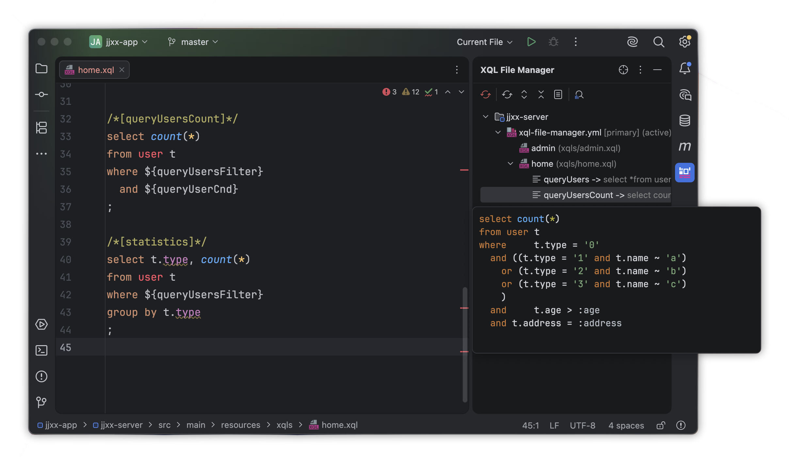

# SQL 模版复用技巧

Rabbit SQL 支持两种形式的模版声明方式，大部分情况下，模版主要用于提取相同的查询条件作为片段，达到在多段 SQL 中复用的效果，但片段往往不是完整的 SQL 语句，在 IDE 中会高亮异常或格式化异常。

所以，为了杜绝上述问题，推荐使用[内联模版](documents/xql-file-manager#md-head-15)声明方式，语法格式为：

```sql
-- //TEMPLATE-BEGIN:myCnd
...
-- //TEMPLATE-END
```

> `myCnd` 为此段模版的名称，可直接在同一个文件内引用。

如果安装有 [IDEA 插件](guides/plugin)，通过输入 `xql:new-inline-template` 自动完成。

如下例子，一个 SQL 中可以定义多个区域的模版片段（不允许嵌套）：

```sql
/*[queryUsers]*/
select * from user t
where 
  t.enable = true
  and
  -- //TEMPLATE-BEGIN:queryUsersFilter
   t.type = '0'
  and((t.type = '1' and t.name ~ 'a')
  or (t.type = '2' and t.name ~ 'b')
  or (t.type = '3' and t.name ~ 'c')
  )
  -- //TEMPLATE-END
  and
  -- //TEMPLATE-BEGIN:queryUserCnd
   t.age > :age
  and t.address = :address
  -- //TEMPLATE-END
  order by dt desc;
```

如上例子，有几个技巧值得关注：

- 模版内部的第一个连接条件 `and` 在外面，为了其他引用的地方主动输入 `and` 可避免 IDE 语法错误的误报
- 2个模版片段命名以当前 SQL 名开始，在大量模版的情况下，可避免混乱

通过 [IDEA 插件](guides/plugin)，可以直接查看模版的合并效果如下图：



> 多个模版引用使用条件连接符可避免语法高亮错误！

模版片段内依然可以使用[动态 SQL](documents/dynamic-sql) 脚本，相互独立的两套逻辑，互不冲突，合理使用，可使整个 SQL 清晰直观。
