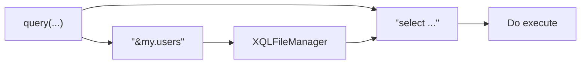

# 核心接口 Baki

直接提供数据库访问功能的接口 `Baki` ，通过实例化此接口的默认实现 `BakiDao` 来执行各种操作，初始化流程如下：

```java
Datasource datasource = new HikariDataSource();
...
BakiDao baki = new BakiDao(dataSource);
```

至此，现已可以通过 BakiDao 来传入 SQL 执行数据库访问操作，还可以选择配置 XQL 文件管理器：

```java
XQLFileManager xqlFileManager = new XQLFileManager("xql-file-manager.yml");
...
baki.setXqlFileManager(xqlFileManager);
```

> 具体配置项请参考文档 [XQL 文件管理器](documents/xql-file-manager)。

Baki 接口提供的所有能传入 SQL 字符串的方法现在都可以传入 “SQL 地址“，通过取地址符 `&` 来获取 XQL 文件管理器中的 SQL，并进行动态解析，例如：`&my.users`，格式为 `别名.SQL名` ：



```java
baki.query("select … where id = :id").args("id", "1")
```

```java
baki.query("&my.users").args("id", "1")
```

> SQL 语法中形如 `:id` 是默认的[命名参数占位符](documents/sql-params)语法。

## 查询

通过 `query` 方法来获得一个查询执行器 `QueryExecutor` ，查询执行器可以返回的数据类型如下：

- `stream()` ：返回一个 `DataRow` 类型惰性查询对象；

- `maps()` ：返回一组 `Map` 结果；

- `rows()` ：返回一组 `DataRow` 包装接口；

- `entities()` ：返回一组实体;

- `pageable(page?, size?)` ：返回一个分页查询构建器，如果不传入 `page` 和 `size` ，则默认从参数中取对应 key 的值；

- `findFirstRow()` ：查询第一条，返回一个 `DataRow` 对象，不会为 `null` ；

- `findFirstEntity()` ：查询第一条，返回一个实体对象，可能为 `null` ；

- `findFirst()` ：查询第一条，返回一个 `Optional` 可空对象；

### 惰性查询

惰性查询返回一个 `Stream` 对象，其内部持有一个 JDBC `Connection` ，当执行调用终端操作执行查询之后，必须关闭 `Stream` ，否则连接不会释放，直到连接池耗尽。

当进行终端操作时才会真正的开始执行查询，例如 `Stream#collect()` ，需要特别注意，推荐使用 **try-with-resource** 语句进行包裹，在查询完成后将自动释放连接对象：

```java
try (Stream<DataRow> s = baki.query("&my.query").args("id", 5).stream()) {
    s.forEach(System.out::println);
}
```

> 需要对结果集进行二次处理，例如调用 `.map(...).filter(...)` 等操作，使用此方法可以有效提高性能。

### 分页查询

默认的分页查询将自动根据数据库生成**分页查询语句**和生成 **count** 查询语句。

内置支持 oracle，mysql，postgresql，sqlite，mariadb，db2，其他可通过实现接口 `com.github.chengyuxing.sql.plugins.PageHelperProvider` 并添加到 BakiDao 进行支持。

```java
PagedResource<DataRow> resource = baki.query("select ... where id < :id")
                .arg("id", 8)
                .pageable(1, 7)
                .collect();
```

> 内建的条数查询 SQL 语句进进行简单的包裹，若要最好的性能，可自行写条数查询 SQL 语句，通过方法 `.count(sql)` 来指定。

#### 自定义分页查询

在一些特殊情况下，内建的分页查询构建器无法满足特别的需求，如下 SQL 分页在视图或子查询中：

```sql
/*[custom_paged]*/
with cte as (
  select * from test.region
  where id > :id limit :start offset :end
  )
select * from t;
;
```

分页构建器需要增加一些配置：

```java
PagedResource<DataRow> res = baki.query("&data.custom_paged")
      .pageable(1, 7)
      .disableDefaultPageSql("&data.custom_paged_count")
      .rewriteDefaultPageArgs(args -> {
      	  args.updateKey(START_NUM_KEY, "start");
      	  args.updateKey(END_NUM_KEY, "end");
      	  return args;
      })
      .collect();
```

- `count(sql)` ：必要的条数查询语句；
- `disableDefaultPageSql(sql)` ：禁用默认生成的分页 SQL，并指定条数查询 SQL 语句；
- `rewriteDefaultPageArgs(func)` ：重写默认的分页参数，因为您自定义的查询 SQL 分页参数名不被限制，所以很有必要调用此方法进行重写，重写为如上例子 `start` 和 `end`；

## 增删改查

- `execute(sql, Map?)` ：支持 select ， ddl ， dml 和  plsql 语句；
- `execute(sql, Collection)` ：批量操作，支持非预编的 ddl 和 dml 语句；
- `insert(sql, Map)` ：执行插入；
- `insert(sql, Collection)` ：执行批量插入；
- `update(sql, Map)` ：执行更新；
- `update(sql, Collection)` ：执行批量更新；
- `delete(sql, Map)` ：执行删除；
- `delete(sql, Collection)` ：执行批量删除；

## 执行存储过程/函数

方法 `call(params)` 返回一个 `DataRow` 包装对象结果，通过命名参数名来获取相应的结果，如果返回值是游标，结果类型为： `List<DataRow>` ，其他情况下返回值类型都为数据库字段类型所对应的 java 数据类型。

```java
baki.call("{:res = call test.sum(:a, :b)}",
   Args.of("res", Param.OUT(StandardOutParamType.INTEGER))
           .add("a", Param.IN(34))
           .add("b", Param.IN(56))
  ).getOptional("res")
```

通过一个函数过程定义来说明一下几种不同的写法：

### 单返回值

```sql
create function sum(a integer, b integer) returns integer
    language plpgsql
 ...
```

**命名返回值的写法**，此时可以通过参数名 `res` 取到结果：

```sql
{:res = call sum(:a, :b)}
```

**匿名返回值写法**，此时可按顺序通过索引 `0` 或默认的 key `result` 来取到结果：

```sql
{call sum(:a, :b)}
```

### 多返回值

多返回值函数定义通常在参数中有多个出参，根据出参的个数按顺序通过索引或者 key 名来取到结果，例如：

```sql
{call multiple_result(:id, :res1, :res2)}
```

### 注意事项

有些情况下，不同的数据库不同的函数定义方式，也限定了只能用某种写法，具体可在调试过程中来调整合适的语法。

例如，如果在 PostgreSQL v13+ 中使用语法 `create procedure` 创建的过程调用写法如下不能加 `{}` 括号：

```sql
call procedure()
```

PostgreSQL 中使用 python 创建的函数返回值，只能使用**匿名返回值写法**，否则会抛出异常：

```sql
create function mvnd(keyword text)
    returns TABLE(group_id text, artifact_id text, latest_version text)
    language plpython3u
as
$$
		...
    for item in arr:
        yield ( item['g'],item['a'],item['latestVersion'] )
$$;
```

调用写法和获取结果：

```java
baki.call("{call mvnd(:keyword)}",
          Args.of("keyword", Param.IN("chengyuxing")))
   .<List<DataRow>>getAs(0);
```
