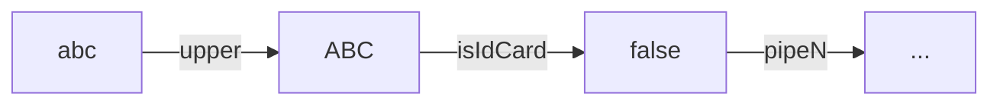

# 动态 SQL

动态 SQL 的工作依赖于[XQLFileManager](documents/xql-file-manager)，基于标准 SQL 注释进行功能扩展，通过解析特殊的注释标记，在不破坏 SQL 文件标准的前提下进行动态编译。

```sql
/*[dynamic-sql]*/
-- #check :age > 30 throw '年龄不能大于30岁'
-- #var safeAge = :age
-- #var id = 14
-- #var users='a,xxx,c' | split(',')
select * from test.guest where id = :id
and name in (
    -- #for item of :users delimiter ', '
        :item
    -- #done
        )
and age < :safeAge
```

## 注释标记

**check**

前置条件检查语句，如果满足条件则抛出异常信息（`CheckViolationException`）。

在数据库真正执行sql之前，对参数做一次合法性验证，避免数据库层面的参数类型错误异常，以节省资源。

```sql
-- #check :id > 10 throw 'ID cannot gt 10.'
...
```

**var**

变量定义语句，变量值可以是常量，也可以是传入的参数经过管道处理，通过扩展管道，实现各种复杂的变量定义。

```sql
-- #var list = 'cyx,jack,mike' | split(',')
-- #var newId = :id
select * from table where id = :newId and name in (
-- #for item of :list
  :item
-- #done
)
```

**if-else-fi**

IF 条件判断语句，逻辑效果和程序语言的 if 一样。

```sql
-- #if :user <> null
    ...
-- #else (可选)
    ...
-- #fi
```

**guard-throw**

守卫语句：如果条件满足则执行分支处理逻辑，否则执行 `#throw` 抛出异常信息并终止后面的所有操作。

```sql
-- #guard :user <> blank
    ...
-- #throw 'message'
```

**switch-case-end**

switch 流程控制语句，效果和程序语言的 switch 一样，按顺序匹配每个 case 分支，当第一个条件满足则直接跳出整个 switch 。

```sql
-- #switch :name
       -- #case 'a', 'b', c
       ...
       -- #break	
       -- #case 'd'
       ...
       -- #break
       ...
       -- #default
       ...
       -- #break
-- #end
```

**choose-when-end**

choose 流程控制语句，效果类似于 switch 语句，按顺序匹配每个 when 分支，当第一个条件满足则直接跳出整个 choose 。

```sql
-- #choose
       -- #when :id >= 0
       	...
       -- #break
       ...
       -- #default
       	...
       -- #break
-- #end
```

**for-done**

for 循环语句，效果和程序语言一样，对一个集合进行遍历，将循环体内的内容进行累加。

```sql
-- #for item,idx of :list delimiter ',' open '' close ''
	...
-- #done
```

**for表达式**语法说明：

关键字：`of` `delimiter` `open` `close`

```
item[,index] of :list [|pipe1|pipeN|... ] [delimiter ','] [open ''] [close '']
```

- `[...]` 表示可选配置项；
- `item` 表示当前值，`index` 表示当前序号；
- `:list` 表示当前迭代的对象，后面可以追加**管道**进行一些特殊处理；
- `delimiter` 表示循环的每项连接符，默认为 `,` ；
- `open` 表示当前循环最终结果的前缀，如果结果不为空，则被添加到前面；
- `close` 表示当前循环最终结果后缀，如果结果不为空，则被添加到后面；

## 表达式脚本

参数键名以 `:` 号开头。

一个简单的表达式语法如下：

```sql
!(:id >= 0 || :name | length <= 3) && :age > 21
```

### 比较运算符

| 运算符 | 说明       |
| ------ | ---------- |
| <      | 小于       |
| >      | 大于       |
| >=     | 大于等于   |
| <=     | 小于等于   |
| ==, =  | 等于       |
| !=, <> | 不等于     |
| ~      | 正则包含   |
| !~     | 正则不包含 |
| @      | 正则匹配   |
| !@     | 正则不匹配 |

- 支持的逻辑符：`||` ， `&&` ， `!` ；
- 支持嵌套括号：`(` ， `)` ；
- 支持数据类型：字符串（`""` ， `''`），数字（12、3.14），布尔值（ `true` ， `false` ）；
- 内置常量：`null` , `blank` ( `null`、空白字符、空数组、空集合)；

> 如果操作符不能满足需求，则可以通过实现自定义管道来进行增强。

### 管道



管道顾名思义，类似于 shell，可以链式使用 `:id | upper | is_id_card | ...` 例如：

```sql
-- 传入的name参数经过名为length的管道输出长度和3进行大小比较
:name | length <= 3
```

通过实现接口 `com.github.chengyuxing.common.pipe.IPipe` 并添加到 [XQLFileManager](documents/xql-file-manager) 来使用管道。

**内置管道**：

- **length**：获取字符串的长度；
- **upper**：转大写；
- **lower**：转小写；
- **kv**：对象或 `Map` 转为一个键值对集合 `List<KeyValue>` ；
- **nvl**：如果值为 `null` 则返回默认值 ，e.g. `nvl('default')`；
- **type**：返回值的 Java 对象类型；
- **split**：根据分隔符将字符串分割为数组，e.g. `split(',')`；

## 示例

以下的例子主要以动态生成**命名参数sql**来展开进行讲解，**命名参数**最终都会被进行预编译为 `?` ，避免sql注入的风险。

**for**标签特别是在构建sql的 `in` 语句时且需要达到预编译sql的效果时特别有用：

```sql
/*[query]*/
select * from test.user where id = 1
-- #for id of :ids delimiter ', ' open ' or id in (' close ')'
    -- #if :id >= 8
    :id
    -- #fi
-- #done
```

为保持 SQL 语法完整性，在具有语法检查的 IDE 中不出现高亮语法错误，推荐下面等效的写法：

```sql
select * from test.user where id = 1
-- #if :ids != blank
or id in (
    -- #for id of :ids delimiter ', '
        -- #if :id >= 8
        :id
        -- #fi
    -- #done
    )
-- #fi
;
```

```javascript
{"ids": [1, 2, 3, 4, 5, 6, 7, 8, 9, 10, 11, 12]}
```

以上将会生成如下 SQL 和一些必要的变量：

```sql
select * from test.user where id = 1
 or id in (
    :_for.id_0_7, 
    :_for.id_0_8, 
    :_for.id_0_9, 
    :_for.id_0_10, 
    :_for.id_0_11
)
```

```javascript
{
  "_for": {
    "id_0_0": 1,
    "id_0_2": 3,
    "id_0_1": 2,
    "id_0_10": 11,
    "id_0_11": 12,
    "id_0_4": 5,
    "id_0_3": 4,
    "id_0_6": 7,
    "id_0_5": 6,
    "id_0_8": 9,
    "id_0_7": 8,
    "id_0_9": 10
  }
}
```

针对几个特别的地方进行说明：

- 当有满足项时，`open` 会在前面加上 `or id in(` , `close` 会在后面加上 `)` , 反之则不会加；
- 在sql中以 `:` 开头的变量名，意味着这是一个将会进行预编译的命名参数；

**for** 也可以用来构建 `update` 语句：

```sql
/*[update]*/
update test.user
set
-- #for set of :sets | kv delimiter ', '
    ${set.key} = :set.value
-- #done
where id = :id;
```

```javascript
{
  "id": 10,
  "sets": {
    "name": "abc",
    "age": 30,
    "address": "kunming"
  }
}
```

以上将会生成如下的sql和一些必要变量：

```sql
update test.user
set
    address = :_for.set_0_0.value,
    name = :_for.set_0_1.value,
    age = :_for.set_0_2.value
where id = :id
```

```javascript
{
  "id": 10,
  "_for": {
    "set_0_2": {
      "key": "age",
      "value": 30
    },
    "set_0_1": {
      "key": "name",
      "value": "abc"
    },
    "set_0_0": {
      "key": "address",
      "value": "kunming"
    }
  }
}
```

说明：

- `:sets` 对应的值是一个 Map 对象，经过 `kv` **管道**后变成了一个**键值对集合**，所以可以用于 **for** 表达式；

根据不同数据库进行判断来拼接适合的 SQL：

```sql
/*[query]*/
select * from test.user
where id = 3
-- #if :_databaseId == 'postgresql'
    ...
-- #fi
-- #if :_databaseId == 'oracle'
    ...
-- #fi
;
```

- 内置变量名 `_databaseId` 值为当前数据库的名称。
