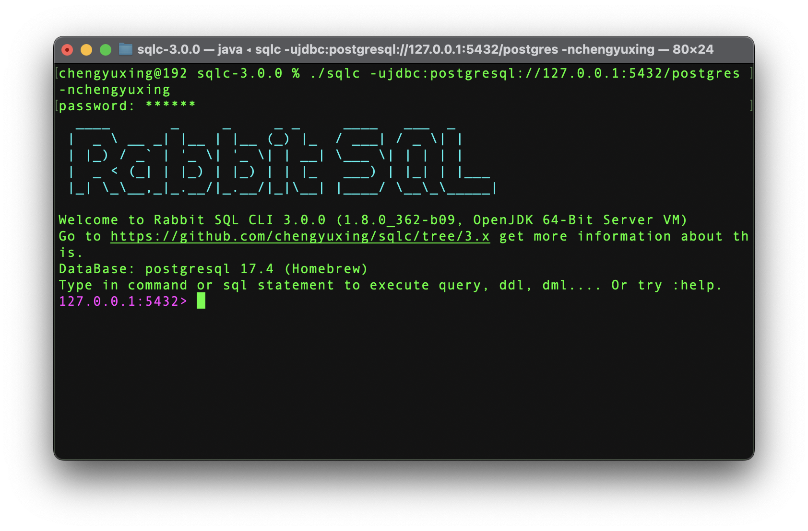
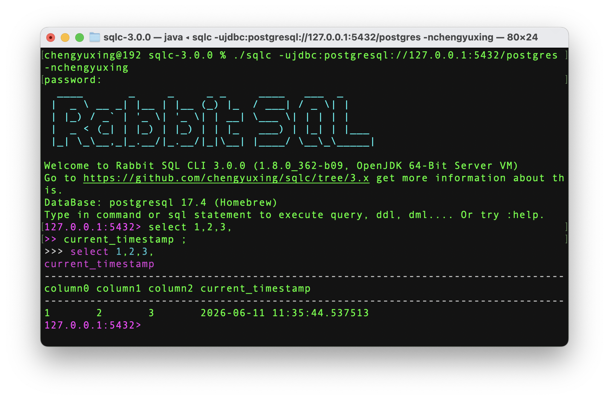
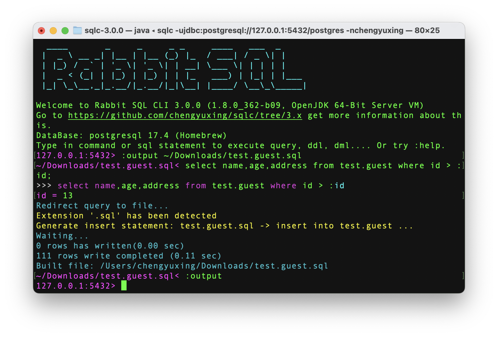
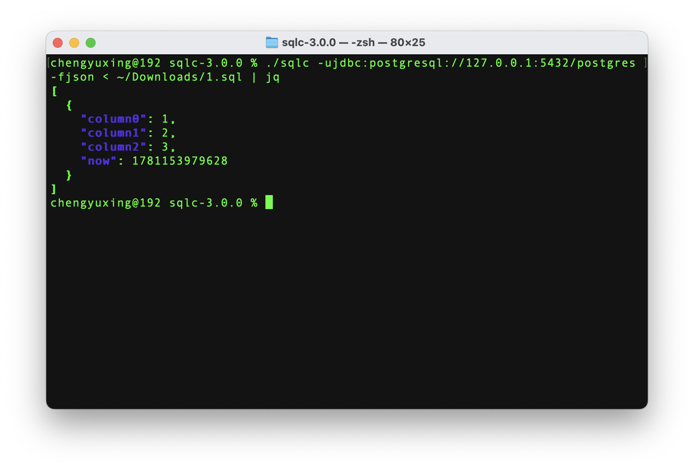
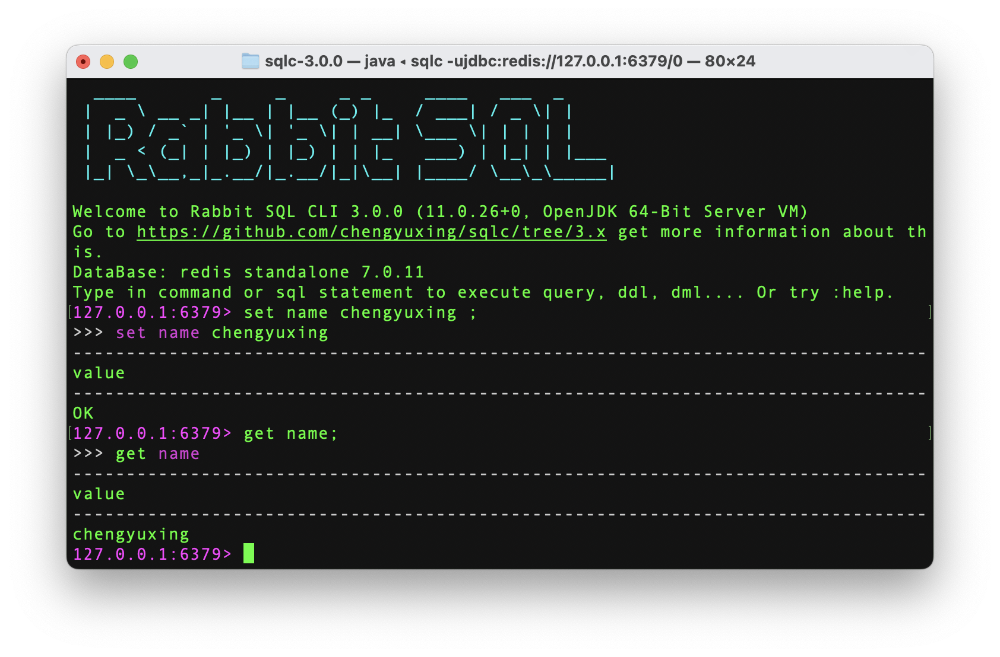
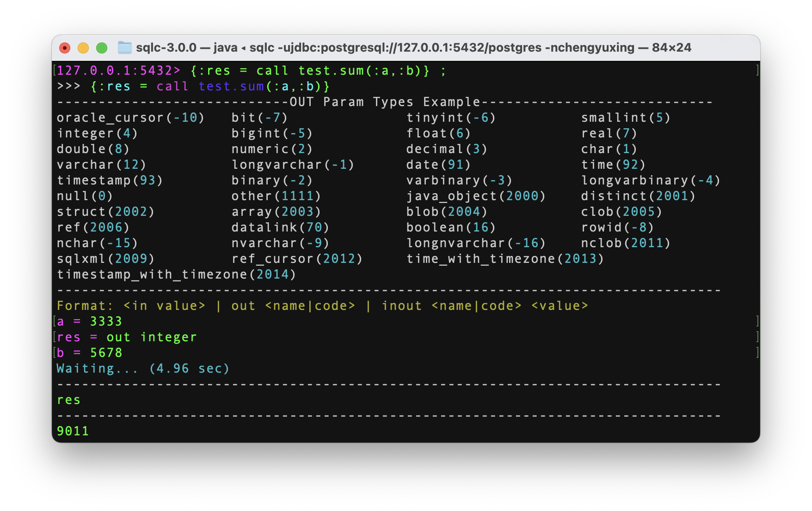
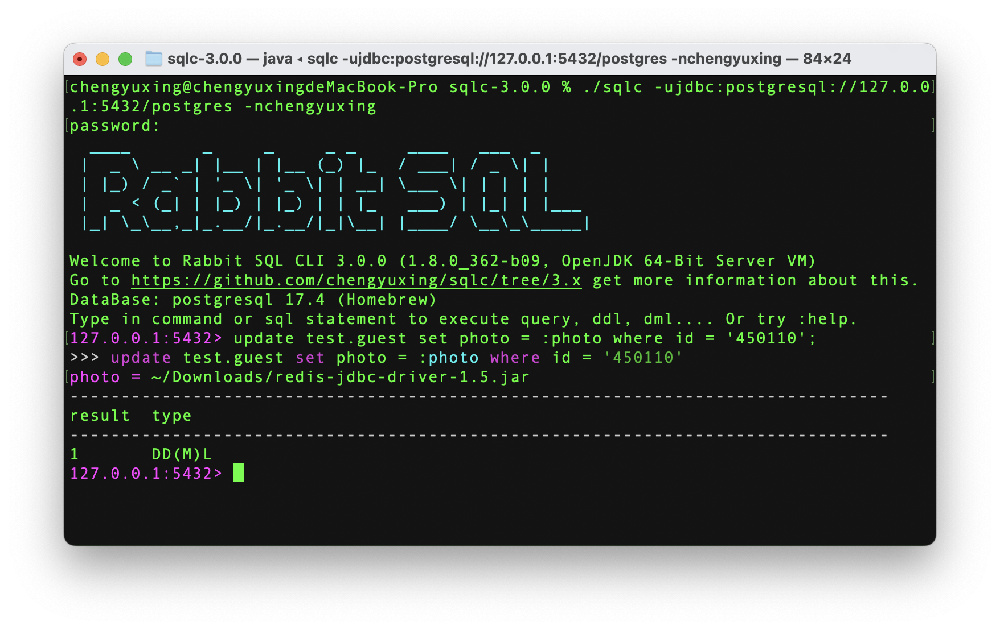

# Rabbit SQL CLI

系统支持：macOS | Linux | Windows ，最低 JDK 版本为 1.8

这是一款基于 [Rabbit SQL](https://github.com/chengyuxing/rabbit-sql) 定制的的[命令行客户端工具][github_release]，旨在通过 JDBC 为无 UI 界面的操作系统提供连接各种数据库的通用能力，特别是针对仅提供了 IP 和端口的数据库。当然，在视窗操作系统中也依然具有一定的意义。



## 说明

### 基础功能

- 执行预编译 SQL（增删改查），存储过程，函数，PLSQL，DDL，DML
- 格式化输出执行 SQL 结果，格式支持：`csv` `tsv` `excel` `json`
- 导出查询结果到文件，支持： `.sql` (包含二进制的 insert 语句) `.csv` `.tsv` `.xls(x)` `.json`
- 批量导入数据，支持： `.sql` (包含二进制的 insert 语句) `.csv` `.tsv` `.xls(x)` `.json`
- 管理 [XQL](documents/xql-file-manager) 文件，执行[动态 SQL](documents/dynamic-sql)
- 支持方向键 <kbd>↑</kbd> <kbd>↓</kbd> 翻阅历史记录，<kbd>Tab</kbd> 关键字、表名、文件路径自动补全，<kbd>Ctrl r</kbd> 查询历史记录等等

### 软件目录结构

```
sqlc-x.x.x/
  |- completion/
     |- database.xql
     |- xxx.cnf
     |- ...
  |- drivers/
  |- lib/
  |- sqlc
  |- sqlc.bat
```

- `completions` 下存放关键字自动完成文件：

  - `database.xql` 可以自行添加数据库查询表名或对象名的 SQL ，格式化标准 XQL 文件，名称为 数据库名，通过 `DatabaseMetadata#getDatabaseProductName` 获取

  - `xxx.cnf` 为数据库的关键字配置文件，文件名为数据库名，同上

- `drivers` 目录下存放 JDBC 驱动程序。

- `lib` 存放程序运行所需的依赖包。

- `sqlc` 为 Bash 终端启动脚本，如果环境变量中存在 `SQLC_JAVA_HOME` ，则根据此环境变量的 java 来启动，否则使用 `PATH` 中的 java 来启动。

- `sqlc.bat` 为 Windows CMD 启动脚本。

### 临时文件目录

```
~/.sqlc/
  |- logs/
  |- history/
  |- temp/
```

- `logs` 目录下可查看详细的运行警告和错误日志。

- `history` 记录了 SQL 和指令的输入历史。

- `temp` 为临时文件夹，退出时会自动清理，无需手动删除。

## 登录

参数 `-u` 为必填，**用户名**和**密码**自动弹出输入框，但在**标准输入模式**中，如果数据库有用户名和密码，必须指定，否则无法登陆。

```bash
$ ./sqlc -ujdbc:postgresql://127.0.0.1:5432/postgres -nchengyuxing
```

> 如果 url 包含特殊符号例如 `?` ，需要使用引号把 url 参数括起来，`-u"jdbc..."`

默认情况下，如果没有其他指令和输入，则进入**交互模式**，连续交互输入 SQL 和指令来实现一些列操作。

## 全局参数

| 参数                   | 默认值 | 描述                                            |
| ---------------------- | ------ | ----------------------------------------------- |
| `-u` , `--url`         |        | 数据库 JDBC url                                 |
| `-n` , `--name`        |        | 数据库用户名                                    |
| `-p` , `--password`    |        | 数据库密码                                      |
| `--driver`             |        | 数据库 JDBC 驱动类全名                          |
| `--batch-size`         | `1000` | 批量导入数据批量执行的大小                      |
| `--named-param-prefix` | `:`    | 预编译 SQL 命名参数前缀                         |
| `--print-rows`         | `100`  | 输出控制台执行 SQL 的结果最大条数，`0` 则无限制 |
| `-h` , `--help`        |        | 获取参数帮助提示                                |

`-u` 为必填，如果没指定 `-n` 和 `-p` 则弹出输入框手动输入。

```bash
$ ./sqlc -u"jdbc:postgresql://127.0.0.1:5432/postgres" -nchengyuxing --print-rows=10
$ ******
```

> 内部根据 `-u` 自动识别数据库驱动，如果没有识别出来，通过参数 `--driver=xxx.Driver` 来指定具体驱动名。

## 模式

有3种模式可用，启动条件分别如下：

1. **命令模式**：参数 `-e` 或 `--import` 存在
2. **标准输入模式**： 参数 `-e` 和 `--import` 不存在，并且标准输入中有内容
3. **交互模式**：以上条件除外，则进入交互模式

### 命令模式

命令模式每次都完整的执行初始化连接登录数据库，主要用户和操作系统其他命令配合，或者用于批量执行，执行一次，计划任务等需求。

#### 执行 SQL

通过 `-e` 来指定 SQL 或者读取文本文件来执行。

```bash
$ ./sqlc <login> \
-e"select current_timestamp" \
-e"select 1,2,3" \
-e ~/1.sql \
-e ~/2.sql
```

> 如果是批量执行 DML 语句，可追加参数 `--with-tx` 来启用事务。
>
> 重定向导出查询结果 `-o` 必须在 一个 `-e` 的情况下才可用。

#### 导出查询

根据软件规范，导出的**文件名或Sheet名就是目标表名**，特别是对于 `.sql` 文件，生成的 insert 语句表名来源于文件名：


```bash
$ ./sqlc <login> -e"select 1,2,3" -o ~/test.guest
```

可以不用加后缀，默认导出格式为 tsv ，通过 `-f` 指定导出类型。

如果后缀为 `.sql` 则忽略 `-f` ，导出文件存在2种结构，根据查询结果字段：

- 全基本数据类型：`test.guest.sql`

- 包含二进制：

  ```
  test.guest_3994950495045/
    |- test.guest.sql
    |- blobs/
       |- blob_0
       |- blob_1
       ...
    |-README.md
  ```

> ⚠️ 如果需要将结果继续批量导入到其他数据库表，不要修改当前文件结构。

#### 批量导入数据

批量导入需要按照约定规范文件，**文件名或Sheet名即是要导入的目标表名**，程序通过文件名自动提取数据库表名并生成 **insert** 语句：


如果是 `.tsv` ， `.csv` ，`.xls(s)` 按照约定，第一行数据是数据库字段名（**index** 从 `0` 开始）：

| id   | name        | age  |
| ---- | ----------- | ---- |
| 1    | chengyuxing | 13   |
| ...  | ...         | ...  |

其他情况指定 `--header-index=`：

- 不存在表头：`-1` 自动通过查询数据库列名**按顺序**进行映射
- 不在第一行，则指定表头所在的行号

针对 Excel 文件 `--sheet-index=`：

- **-1** : 读取第一个 Sheet 的数据，并从文件名获取表名
- **大于等于 0** ：读取指定 Sheet 的数据，并从 Sheet 名获取表名

```bash
$ ./sqlc <login> --import ~/test.guest.xlsx \
--sheet-index=1 \
--header-index=1
```

**导入 insert SQL 文件**：

指定 insert SQL 文件，如果**需要导入二进制数**据前提是必须符合以下规范：

- SQL 文件所在目录下必须有 `blobs` 文件夹
- `blobs` 文件夹内的文件名必须和 SQL 的参数名一一对应
- insert SQL 文件，二进制部分必须使用预编译参数 `:name` 来与 `blobs` 下的文件名一一对应

文件结构如下：

```
~/my_folder/
  |- test.guest.sql
  |- blobs/
      |- photo_0
      |- photo_1
      |- photo_5
      ...
```

SQL 格式：

```sql
insert into test.guest(name, age, photo) values ('cyx', 13, :photo_0);
insert into test.guest(name, age, photo) values ('cyx', 13, :photo_1);

...
```

> 如果是通过指令 `-o` 导出的 insert SQL 包含二进制数据，则默认就是如上的结构，可直接导入其他其他表或其他数据库。

#### 参数说明

| 参数               | 默认值 | 描述                                                         |
| ------------------ | ------ | ------------------------------------------------------------ |
| `-e` , `--execute` | `[]`   | 读取文件或字符串执行一条或多条 SQL                           |
| `-o` , `--output`  |        | 输出查询结果到文件，文件类型由 `-f` 决定，默认 `tsv` ，如果文件后缀以 `.sql` 结尾，则忽略此参数并导出 insert 语句 SQL 文件 |
| `-f` , `--format=tsv\csv\json\excel` | `tsv`  | 指定打印结果和输出文件的格式                                 |
| `--import`         |        | 执行批量导入数据，**文件名为表名**，支持文件类型：`.csv` ,  `.tsv` ,  `.json` ,  `.xls(x)` ,  `.sql` |
| `--sheet-index`    | `0` | `--import` 文件类型 `.xls(x)` 的 Sheet 序号 |
| `--header-index`   | `0` | `--import` 文件类型 `.xls(x)` ,  `.csv` ,  `.tsv`的字段表头所在行 |
| `--with-tx`        | `false` | `-e` , `--import`启用事务，成功则提交，失败则回滚 |
| `--ping`           |        | 检测数据库是否连接成功，成功则返回 `pong` |

### 交互模式

登录一次，进入交互终端，持续输入 SQL 或指令来完成一些列操作。

```bash
$ ./sqlc <login>
```

#### 执行 SQL

多行 SQL 直接按 <kbd>Enter</kbd> 换行即可，以 `;` 结尾判定输入完成并执行。



或者通过 `:exec` 读取一个文本文件内的 SQL ，`:paste` 打开编辑器粘贴一段 SQL 来执行。

#### 导出查询

通过指令 `:output <file>` 开启**持续输出模式**，后续所有查询都将进行重定向输出到目标文件，格式通过 `:view` 来指定，输出文件格式逻辑同命令模式的 `-o` 参数。

如果要输出到不同的文件，重新执行指令输出到新文件。

关闭输出模式则输入 `:output` 不指定文件，即退出输出模式。



#### 批量导入数据

```
:import <file [sheetIndex [headerIndex]] | [headerIndex]>
```

逻辑和 `--import` 一样，后面分别根据文件类型指定 Sheet 和 header 的 index：

```
127.0.0.1:5432> :import ~/test.guest.xlsx 1 1
```

#### 加载 XQL 文件

在登录时通过 `--xql` 或者进入交互模式后通过 `:xql` 来指定文件或文件夹。

加载完成后即可实现以下功能：

- 使用 `:status &` 命令来查看 [XQL](documents/xql-file-manager) 加载信息
- 使用 `:exec &<sqlName>`  来执行动态 SQL

#### 参数说明

| 参数    | 默认值 | 描述                                         |
| ------- | ------ | -------------------------------------------- |
| `--xql=<file\folder>` | `[]`   | 加载 `xql` 文件，或文件夹下的所有 `xql` 文件 |

> 如果有且仅一个，并且是文件夹，则加载文件夹下的所有 `xql` ，否则认为是 `xql` 文件。

| 指令 | 默认值 | 描述 |
| ---- | ------ | ---- |
| `:exec <sqlFile\&sqlName>`  |        | 读取文件执行 SQL 或执行一个 XQL 动态 SQL |
| `:import <file> [s] [h]` |        | 批量导入一个文件，并可选的指定 Sheet(`s`) 和 header(`h`) 序号，同 `--import` |
| `:xql <file\folder>` |        | 同 `--xql` |
| `:paste` | | 使用 nano 编辑器输入或粘贴大段 SQL 执行：<kbd>Ctrl o</kbd> <kbd>Enter</kbd> <kbd>Ctrl x</kbd> |
| `:tx <[begin\commit\rollback]>` | `begin` | 开启/提交/回滚事务 |
| `:output <[file]>` |  | 指定输出目录则开启查询重定向输出，否则关闭重定向输出 |
| `:view <csv\tsv\json\excel>` | `tsv` | 指定查询结果打印格式和 `:output` 输出文件格式，逻辑同 `-o` |
| `:status <[&[<alias>[.<name>]]]>` |  | 查看当前配置状态：默认查看概括，`&` 查看 xql 文件资源列表，`&<alias>` 查看 xql 文件所有 SQL 对象，`&<alias>.<name>` 查看 SQL 内容 |
| `:q` |  | 退出程序 |
| `:help` |  | 查看指令帮助说明 |

### 标准输入模式

通过标准输入和输出来配合终端的重定向和管道功能来增强使用体验，标准输入接收一段 SQL，标准输出打印执行 SQL 的结果，由于标准输入无法弹出输入框，有如下限制：

- 如果有用户名和密码，需要显示指定 `-n` 和 `-p` 
- 无法使用预编译 SQL，只能执行普通 SQL
- 输出重定向无法输出 Excel(`.xqls(x)`) 二进制文件（使用 `-o` 替代）

输入和输出支持的参数有：

- `-u` , `-n` , `-p` , `--driver` , `--print-rows` 
- `-f` , `-o` , `--with-tx`

以下例子通过组合指令实现：

1. 使用 `cat` 读取一个 SQL 文件内容输入给 `sqlc`
2. 执行查询并输出 JSON 数据
3. 通过管道使用 `jq` 格式化美化
4. 把美化后的 json 结果写到文件 `result.json`

```bash
$ cat ~/1.sql | ./sqlc -ujdbc:postgresql://127.0.0.1:5432/postgres -fjson | jq > result.json
```

输出：

```json
[
  {
    "column0": 1,
    "column1": 2,
    "column2": 3,
    "now": 1781103977943
  }
]
```

从标准输入读取一个 SQL 文件：



## 参考

### 连接 Redis

程序目录 `drivers` 内已有 redis 驱动，但 java 环境至少需要 JDK11，连接 redis 效果如下：



### 执行存储过程

存储过程写法为：以 `call` 开头 或者 `{` 开头，具体写法不同的数据库写法略有差别，参数输入框分为 3 种类型：

- 入参：直接输入具体的值
- 出参：`out` ` ` 类型名称或类型代码
- 入出参：`inout` 类型名称或类型代码 ` ` 具体的值

类型代码可参考控制台打印的例子，如果没有的类型，需要根据实际具体的数据库对应结果的类型代码。



### 插入文件

可通过执行预编译 SQL 弹出参数输入框，如果参数识别格式为路径，则读取文件二进制写入参数，路径格式识别前缀包括：

- `~/`
- `./`
- `../`
- `/`



### SQL 关键字补全

配置文件位于[软件目录](#软件目录结构)的：`completion` 文件夹下。

#### 静态配置

默认根据数据库名字读取对应的 `.cnf` 文件，数据库名字可以在登录成功后的信息输出看到：

```
DataBase: postgresql 17.4 (Homebrew)
```

> [name] [version]

根据需求增加关键字，或者新建新的数据库名字配置文件 `xxx.cnf` 。

#### 动态配置

编辑 `database.xql` 文件，运行时参数为 `username` （当前用户），增加更多的对象查询结果，例如更多的表名、函数名、存储过程名，默认取结果的**第一列**。

若要增加新的数据库，根据 [XQL](documents/xql-file-manager) 文件规范，SQL 名字为数据库的名字，例如：

```sql
/*[sqlite]*/
select ...;
```

> ⚠️ 仅支持执行查询 SQL 语句。

### 配置环境变量

为避免系统的 `JAVA_HOME` 版本与本程序不兼容导致的启动异常，可以配置其专属的 `JAVA_HOME`

在 `.zshrc` 或 `.profile` 等下面加入：

```bash
export SQLC_JAVA_HOME=/otherJavaHome
```

如果此变量存在，则优先使用。

### 下载地址

[Github][github_release]  [Gitee][gitee_release]

最后 <kbd>Ctrl c</kbd> Bye bye :(


[github_release]:https://github.com/chengyuxing/sqlc/releases
[gitee_release]:https://gitee.com/cyxo/sqlc/releases
